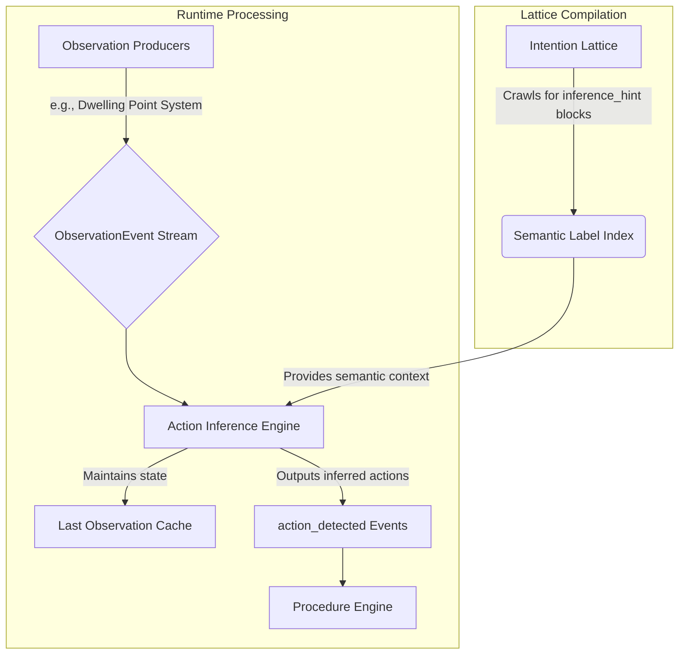

# The Noet Action Inference Engine

## 1. Purpose

This document specifies the design of the **Action Inference Engine**, a core component of the Noet architecture. The engine's primary responsibility is to bridge the gap between low-level, objective sensor data and high-level, subjective meaning. It transforms a stream of heterogeneous **Observation Events** from multiple sources (e.g., location, screen activity, ambient audio) into a probabilistic stream of inferred, meaningful **actions** that can be matched against the participant's Intention Lattice.

The engine is responsible for parsing the entire `inference_hint` structure defined in `action_interface.md`, including nested logical operators (`any_of`, `all_of`) and per-event constraints (like `min_duration_minutes`), to match complex, multi-modal patterns.

This design solves the critical problem of translating fragmented, multi-modal data into a coherent understanding of "what the participant is likely doing," enabling the system to operate on the principle of "Inference Over Interruption."

## 2. Core Concepts

The engine is built on a probabilistic foundation, acknowledging that we can never be 100% certain about a participant's actions. The core of the design is the **Hidden Markov Model (HMM)**, a statistical model well-suited for modeling sequences of observable events.

-   **States (Hidden):** The true, unobservable actions the participant is engaged in (e.g., `act_sleeping`, `act_working_deeply`, `act_eating_dinner`). These correspond to `action` nodes in the Intention Lattice.
-   **Observations (Visible):** A heterogeneous sequence of `ObservationEvent`s produced by various monitors (e.g., the Dwelling Point system, a screen monitor daemon). These are the concrete, observable data points.
-   **Transition Probabilities:** The likelihood of moving from one action (state) to another (e.g., the probability of transitioning from `act_sleeping` to `act_making_breakfast`).
-   **Emission Probabilities:** The likelihood of a specific `ObservationEvent` occurring given a particular action (state) (e.g., the probability of receiving a `{ channel: "Location", producer: "DwellingPointVisit", entity_id: "dp_home_bedroom" }` event while in the `act_sleeping` state).

The engine's task is to calculate the most likely sequence of hidden states (actions) given a sequence of diverse observations.

## 3. Data Flow and Semantic Mapping

To connect low-level `ObservationEvent`s to high-level `action` nodes, the engine follows a clear data flow. It relies on a compilation step to understand the participant's desired patterns and a runtime process to map incoming data to those patterns.



### 3.1. The Semantic Label Map

The engine is responsible for maintaining a **Semantic Label Map**, which connects the raw, machine-generated IDs from `ObservationEvent` producers to the human-readable, semantic labels defined in the Intention Lattice. This map is the bridge between the objective and subjective worlds. Multiple Raw IDs can point to the same semantic id, and a single raw ID can point to multiple point to multiple semantic IDs. This accommodates for example, multiple locations having the same semantic meaning (e.g. multiple bathrooms in one house), as well as a single location having multiple semantic meanings (e.g. a home bathroom is simultaneously a "bathroom", "shower", "bath", and "home_bathroom"). The map should include a notes column to ensure the participant can annotate the mapping.

-   **Source of Semantics:** The "right" side of the map comes from the participant's Intention Lattice. Before runtime, the engine crawls all `inference_hint` blocks (see `action_interface.md`) to compile a unique set of all semantic labels used (e.g., `"home"`, `"work_office"`, `"app_zed_editor"`).
-   **Source of Raw IDs:** The "left" side of the map is populated at runtime. `ObservationEvent` producers are unsupervised classification systems that generate events with cluster IDs (e.g., a dwelling point `dp_7a3f9b2c`).
-   **Mapping Process:** The engine needs to map these two sides. This is achieved through a **Model Calibration** attention window (see below), where the participant is asked to associate a newly discovered raw ID with a known semantic label.

For example, the map might contain the entry:
`{ "dp_7a3f9b2c": "home" }`

### 3.2. Last Observation Cache

To understand transitions and durations, the engine must maintain a **Last Observation Cache**. This is a simple in-memory data structure that holds the most recent `ObservationEvent` for each `channel`.

-   **Structure:** `Map<channel_id, ObservationEvent>`
-   **Function:** When a new event arrives, the engine can look up the last event for that channel to:
    1.  Determine the `from_entity_id` if it was not explicit in the new event's payload.
    2.  Calculate the duration between the last event and the current one, which is used for matching against `min_duration` or `max_duration` constraints in `inference_hint` blocks.

## 4. Architecture

The Action Inference Engine is designed as a two-pathway system to balance real-time responsiveness with the ability to learn and adapt over time. It ingests a stream of `ObservationEvent`s from multiple sources and outputs `action_detected` events to be consumed by the Procedure Engine.

### Pathway A: Real-Time, Heuristic-Based Inference

This pathway provides immediate, best-effort action inference. It is designed to be simple, fast, and computationally cheap.

1.  **Input:** A new `ObservationEvent`.
2.  **Mechanism:** The engine maintains a set of simple rules and lookup tables that map specific `ObservationEvent` patterns to the most likely action id. This mapping is bootstrapped from the `inference_hint` in an action's `interface` block (see `action_interface.md`) and is continuously updated by the results from Pathway B.
3.  **Logic:** An event from the Dwelling Point system for `dp_work_office` might weakly suggest `act_work_focused`. If this is followed by a `ScreenActivity` event for a code editor, the combined evidence would trigger an `action_detected` event for `act_work_focused` with a high confidence score.
4.  **Output:** A real-time `action_detected` event.

### Pathway B: Offline, HMM-Based Learning and Refinement

This pathway is the adaptive core of the engine. It runs periodically as a background task to analyze historical data, learn the participant's routines, and update the models used by Pathway A.

1.  **Input:** A historical sequence of `ObservationEvent`s from the last 24-48 hours.
2.  **Mechanism:** The engine uses the participant's Intention Lattice to define the possible hidden states (all nodes of `type: action`). It then uses the **Viterbi algorithm** to find the most likely sequence of actions that explains the observed sequence of multi-modal events.
3.  **Learning (Baum-Welch Algorithm):** The engine uses an unsupervised learning algorithm (like Baum-Welch) to iteratively refine the transition and emission probabilities of the HMM. This allows the model to learn complex correlations, such as "the action `act_social_media_browsing` is highly likely to occur when at `dp_home_living_room` and the active application is `Instagram`."
4.  **Output:**
    *   **Updated HMM Parameters:** The refined transition and emission probabilities are saved.
    *   **Refined Heuristic Map:** The learned associations are used to update the simple models for Pathway A.
    *   **Corrective Events:** If the HMM finds a much more probable explanation for a past event sequence, it can emit corrective events.

## 4. Schemas

### Input Schema: The Unified Observation Event

The engine consumes `ObservationEvent` objects from any registered source. This structure is designed to describe a **transition** between states or clusters detected by an unsupervised observation producer.

```rust
pub struct ObservationEvent {
    // The modality of the observation, corresponding to the Action Modality Framework
    pub channel: String, // e.g., "Location", "Visual", "Acoustic"

    // The ID of the algorithm that produced the observationEvent
    pub producer: String, // e.g., "DwellingPointVisit", "ScreenActivity", "VoiceSentiment"

    // The ID of the state/cluster being transitioned FROM.
    pub from: Option<String>, // e.g. UUID

    // The ID of the state/cluster being transitioned TO.
    pub to: Option<String>, // e.g., UUID

    pub timestamp: String, // ISO 8601 datetime

    pub confidence: f64
}
```

An `ObservationEvent` describes a change. For example, a `DwellingPointVisit` event is generated when the participant *arrives* at a new dwelling point. In this case, `to` would be the ID of the new dwelling point, and `from` would be the ID of the previous one. If the participant was in a transient state (e.g., commuting), `from` might be `None`.

**Example Payloads:**

-   **DwellingPointVisit:** `{ "start_time": "...", "end_time": "...", "duration_minutes": 60 }`
-   **ScreenActivity:** `{ "app_name": "Slack", "app_category": "Communication", "duration_seconds": 120 }`
-   **VoiceSentiment:** `{ "sentiment": "positive", "confidence": 0.9, "is_self": true }`

### Output Schema

The engine produces `action_detected` events.

```json
{
  "event_id": "evt_12345",
  "timestamp": "2025-10-28T09:00:00Z",
  "source": "ActionInferenceEngine",
  "event_type": "action_detected",
  "payload": {
    "node_id": "act_work_focused",
    // Corresponds to the `id` from the matched `interface` block in the lattice.
    "inference_id": "work_deep_v2",
    "confidence": 0.92,
    "duration_minutes": 60,
    "supporting_data": [
      {
        "channel": "Location",
        "producer": "DwellingPointVisit",
        "to": "dp_work_office_cubicle_3b"
      },
      {
        "channel": "Visual",
        "producer": "ScreenActivity",
        "to": "app_zed_editor"
      }
    ]
  }
}
```

The `payload.inference_id` is a critical field, as it links the detected action back to the specific `inference_hint` pattern that was successfully matched. This allows the Procedure Engine and other downstream consumers to know exactly which definition was triggered.

## 5. Examples

### Example 1: Multi-Modal Inference of "Video Conference"

1.  **Observation Sequence:**
    1.  `{ channel: "Location", producer: "DwellingPointVisit", to: "dp_work_office" }`
    2.  `{ channel: "Visual", producer: "ScreenActivity", to: "app_google_meet" }`
    3.  `{ channel: "Acoustic", producer: "VoiceActivity", payload: { "is_speaking": true, "duration_seconds": 300 } }`

2.  **Inference Process:**
    *   The `DwellingPointVisit` alone is ambiguous. It could be any work-related action.
    *   The subsequent `ScreenActivity` for Google Meet strongly increases the probability of `act_video_conference`.
    *   The `VoiceActivity` event provides further confirmation, leading the engine to emit an `action_detected` event for `act_video_conference` with very high confidence.

3.  **HMM Learning:** Pathway B will analyze this sequence and strengthen the emission probabilities linking all three of these distinct `ObservationEvent` types to the `act_video_conference` state.

## 6. Integration Points

-   **Upstream Dependencies:** The engine now depends on a variety of **Observation Producers**. The **Dwelling Point System** (`dwelling_point_design.md`) is just one such producer. Others could include a `ScreenMonitor` daemon, an `AudioMonitor` service, etc.
-   **Downstream Consumer:** The primary consumer of the engine's output is the **Procedure Engine** (`procedure_engine.md`).
-   **Configuration Source:** The engine reads `action` nodes from the **Intention Lattice** (`intention_lattice.md`). The `interface.inference_hint` block on these nodes provides the initial hints for the HMM's emission probabilities.

## 7. Model Calibration and User Feedback

To populate the Semantic Label Map, the engine must interact with the participant. This is done through a special **Model Calibration** attention window. This is a unique type of prompt, as it is generated by the engine itself rather than being triggered by a procedure in the Intention Lattice.

### 7.1. The Calibration Prompt

When the engine receives an `ObservationEvent` with a `to_entity_id` that is not in the Semantic Label Map, it can trigger a calibration prompt.

**Example Prompt:**

> "I've noticed a new location pattern (`dp_xyz_789`), I think you were in this location between HH:MM and HH:MM today. What does this place mean to you?
>
> [Home] [Work] [Gym] [Other...]"

The participant's response directly updates the Semantic Label Map. They can also define new actions and/or `inference_hint`s to complete this mapping.

### 7.2. Unmapped Label Awareness

The system can also detect when semantic labels defined in the Intention Lattice have no corresponding raw IDs. This suggests an aspirational action that is not yet being observed.

**Example Prompt:**

> "Your lattice includes an action that happens at the 'Gym', but I haven't observed any location patterns with that label yet. Would you like to review the pattern?"

This creates a feedback loop that helps the participant align their intentions with their observed reality. It also could be due to semantic synonyms -- the lattice could include multiple semantic labels for the same type of observation transmission event. The engine should try to show the user similar labels within their lattice that might be redundant.

### 7.3. Interface Requirement

To achieve this, the engine needs a special interface to inject these prompts into the user-facing application. This is a privileged operation, as it originates from a system component rather than the participant's own lattice. The design of this interface will need to ensure that such prompts are clearly distinguished from contemplative prompts defined by the participant.

## 8. Open Questions & Future Work

-   **Observation Producers:** The design and implementation of other observation producers (like the `ScreenMonitor`) is now a key dependency for unlocking the full potential of this engine.
-   **Event Fusion:** For actions that require near-simultaneous events (like a video conference requiring both screen and audio activity), the real-time pathway will need a more sophisticated event correlation mechanism than simple sequencing.
-   **Cross-Device Observation:** How can the system fuse observation events from multiple devices (e.g., a laptop and a phone) into a single, coherent stream? This will require a secure device-to-device communication channel.
