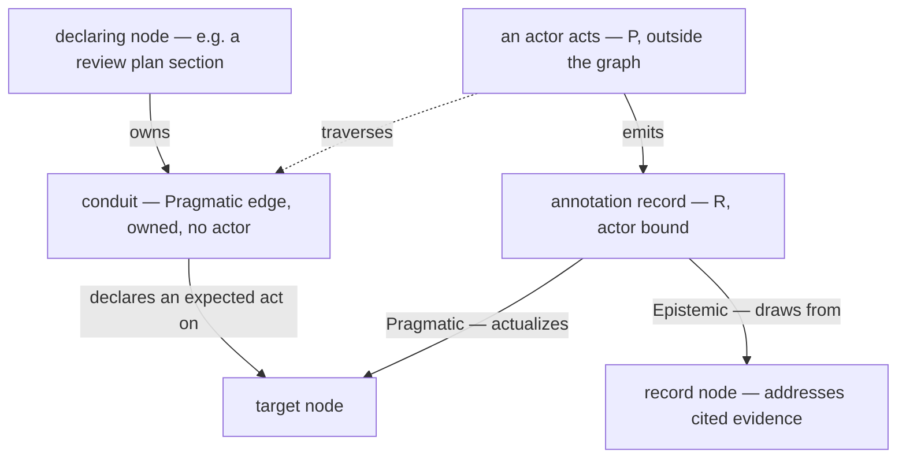
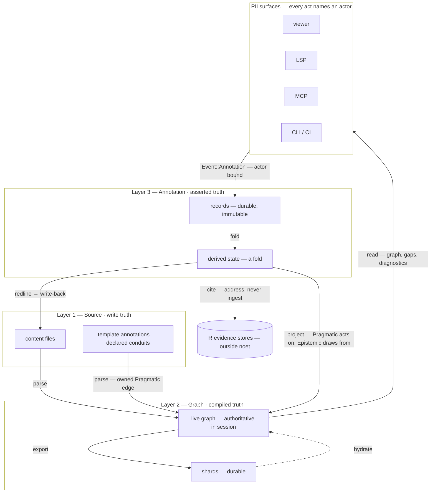

# The Living Corpus

> [!NOTE]
> **This document describes a target architecture.** The Layer 1 → Layer 2 path
> is implemented and in production use. Most of Layer 3, and the return path
> from Layer 3 to Layer 1, are designed but not built. §9 maps every element to
> either an implementation site or the issue that will build it — read it as the
> ground truth for what exists today.

## 1. Purpose

`architecture.md` explains how noet compiles documents into a graph. It stops at
the compiled artifact. This document describes what happens *after* — how a
compiled corpus becomes something people work in rather than something they read.

A compiled corpus is a dead artifact. It answers questions but records nothing
about the asking. A reader who spots a gap, a reviewer who approves a section, an
engineer who marks a requirement as needing work — none of that survives the next
build. Yet those acts are what turn a documentation set into an operational one.

Three commitments define the architecture:

1. **Annotations live on top of the source, not in it.** They are assertions
   about content, not content. Putting them in source would make every comment a
   commit and every reviewer a committer.
2. **Assertions and mutations are different kinds of thing.** Conflating them is
   the design error this document exists to prevent.
3. **The loop must close.** An annotation that cannot become a change is a
   suggestion box. The path from "this is wrong" to "this is fixed" is the point.

**Scope.** This document owns the layer model, the assert/mutate boundary, and
the annotation loop. It does not specify the record schema
(`beliefbase_architecture.md` §4.3), the general provenance model
(`attestation_fabric.md`), or how a corpus is shared between people and machines
(`federated_belief_network.md` — which is mostly a Layer 3 concern, since Layer 1
sharing is git's job and Layer 2 is derived from Layer 1).

---

## 2. Three Layers

```
Layer 3: Annotation          "What have people claimed about the content?"
  Immutable authored claims, multi-writer, append-only
  Durable: sidecar files · Live: derived state (a fold)

Layer 2: Belief Graph        "How does the content relate?"
  Typed multigraph, single-owner-per-node
  Durable: shards · Live: in-memory graph

Layer 1: Source              "What content is in the data?"
  Filesystem, git
  Durable: the files themselves — the write truth
```

**Federation is primarily a Layer 3 protocol**, because Layer 3 is the only layer
that cannot be derived or shared by existing tooling — L1 is git's job, and L2 is
a pure function of L1. See `federated_belief_network.md` §1.1.

**Why three and not two.** Layer 1 and Layer 2 are related by *compilation* — a
deterministic function from files to graph. Layer 3 cannot be compiled from
Layer 1, because its content does not exist in the files. It is a separate input
with a separate lifecycle, separate ownership, and separate durability.
Collapsing it into either neighbour produces either "every comment is a commit"
(folded into L1) or "annotations vanish on rebuild" (folded into L2).

**Layer 3's substrate is not a CRDT library.** Layer 3 is a set of immutable
records with globally unique IDs, which is a **G-Set** — merge is set union,
conflicts are impossible by construction. Automerge remains relevant only for
character-level concurrent text editing, which is out of scope. See
`federated_belief_network.md` §2.3.

**Layer 3 holds a privileged subset of `R`.** Every annotation *is* an as-run
record (`R` in `../essays/engineering_model_ontology.md` §3.4) — an observation
pinned to a moment, immutable once made. §3.4 says so directly: "an automated test
pipeline is as much a `P`-identity as a human reviewer; both require
characterization for the resulting `R` to be interpretable." A review is `P`
acting on `S`; the record of it is `R`. There is no separate category.

What distinguishes an annotation is not its kind but its **subject and its
volume**:

| | Annotation | General `R` |
|---|---|---|
| Subject | a node in *this* graph | the world |
| Produced by | a `P` that is usually human, always identified | any `P`, often machine |
| Volume | one per deliberate act — human-scale | unbounded |
| Individually meaningful | yes — it is attributable and disputable | rarely; value is in aggregate |
| Projects into the graph | as a node plus edges | as a *summary*, cited |

The privilege is architectural: because an annotation names a node in this graph
and arrives at human scale, it can be stored, projected, and queried
individually. A telemetry stream cannot — not because it is a different kind of
thing, but because a million of them would flood a store sized for deliberate
acts and a graph in which every node is addressable.

So the operative rule is unchanged even though the taxonomy is: **test results,
telemetry, and build logs stay outside the annotation store and must not each
project into a graph node.** They connect by **citation** — an attestation claims
something and cites `R` as evidence via `caused_by` / `evidence_hash`
(`attestation_fabric.md` §4.2a). What a citation points *at* is §8.

Calling an annotation "disputable" and general `R` "not wrong" is a distinction
about *subject*, not epistemics: a measurement can be mis-contextualised and a
review can be mistaken, but only the review makes a claim about something the
graph contains. See also `beliefbase_architecture.md` §4.3.

**Layers 2 and 3 reach "no conflicts" by different routes**, which is why they are
separate layers rather than one log:

| | Layer 2 | Layer 3 |
|---|---|---|
| Entries | mutations — order-dependent | assertions — order-independent |
| Ownership | one writer per node | many writers, uncoordinated |
| Merge | replay in order | set union |
| Conflicts avoided by | partitioned ownership | immutability |

A rename followed by a content update is not the same as the reverse, so Layer 2
must replay in order. Layer 3 records are immutable, so order affects only
presentation. `federated_belief_network.md` §2.3 develops this for peer
replication.

### Layer 3's live projection is a held-out BeliefBase

"Derived state" above is deliberately vague. Made precise: **the annotation
layer's live projection is a held-out BeliefBase — in essence a diff applied to
its root corpus context.** Fold the records, project them (§4), and apply the
resulting `BeliefEvent`s into a graph held *separately from* the compiled one.

> **The projection's concrete form is specified in
> [`overlay_model.md`](./overlay_model.md), which is authoritative for it.**
> Briefly: it is not literally a `BeliefGraph`. `BeliefGraph::union_mut`
> (`src/beliefbase/graph.rs:706-714`) replaces nodes wholesale, so an overlay
> holding only *observations about* a node would erase that node's other content.
> The recommendation is a read-through wrapper implementing `BeliefSource` —
> BeliefBase-*like* rather than a BeliefBase. **Issue 110 step 1 ratifies it**,
> at which point this section's wording narrows to match. The layer model here is
> unaffected either way.

Reading the corpus with annotations live is reading the compiled graph with that
overlay continuously merged on top; reading it without is dropping the overlay.
Nothing is written into the compiled graph to make the first true, and nothing
is undone to make the second.

**Diff is therefore the annotation layer's native operation, not machinery
borrowed for it.** Comparing "corpus" against "corpus + overlay" *is* reading the
overlay. Issue 74's `Diff` render mode is the surface; §11 develops the case that
forces it.

**This is §3's pattern, not an exception to it.** Sidecar records are the durable
store, the held-out graph is the live projection, and the fold is the rebuild —
so the loader that hydrates shards into a graph is the loader that hydrates
records into the overlay. That is the "same loader" §3 argues for, made concrete.

**The overlay is downstream of interpretation, never a bypass around it.** It is
*produced by* folding annotations; it is not a place annotations are written. An
`Annotation` remains a claim requiring interpretation and a `BeliefEvent` remains
an instruction the store applies directly; the fold is still the only bridge
between them (§4; `beliefbase_architecture.md` §4.3). Read "the annotation layer
holds a BeliefBase" as "the projection's output is a graph" — never as
"annotations are BeliefEvents".

**The annotation server is this overlay plus the machinery that maintains it** —
scoping (§6), persistence (Issue 105), and propagation between scopes and peers
(`federated_belief_network.md` §1.2). It holds a BeliefBase out; it is not one.

---

## 3. The Same Pattern, Three Times

Every layer is a **durable store plus a live projection**:

| Layer | Durable store | Live projection | Rebuild operation |
|---|---|---|---|
| 1 | source files | — | — |
| 2 | shards | in-memory graph | hydrate |
| 3 | sidecar records | derived state | fold |

The projection is always reconstructible from the store, and the store is never
queried directly. This is why:

- `noet serve` can be stateless between restarts — the graph rehydrates from
  shards rather than from a persistent database.
- Annotation state (is this todo open? is this signed off?) is never stored, only
  computed. A close is a *new record* citing the original, never an edit.
- The same loader should serve both. The annotation store hydrating into the live
  graph is structurally the shard loader with a different input; writing a second
  one would duplicate a solved problem. This holds precisely because Layer 3's
  live projection is itself a graph — a held-out BeliefBase (§2) — and not a
  bespoke state object.

Recognising the pattern once prevents three independent implementations of it.

---

## 4. Assert vs. Mutate

The central type distinction:

```rust
pub enum Event {
    Ping,
    Belief(BeliefEvent),        // mutation — "the graph now contains this"
    Annotation(Annotation),     // assertion — "someone said this about that"
}
```

A `BeliefEvent` is an *instruction*: the store applies it directly. An
`Annotation` is a *claim*: it must be interpreted before it affects anything.

**Assertions project into mutations, never the reverse.** Folding an `Annotation`
emits `BeliefEvent`s per the mapping in `attestation_fabric.md` §12.3:

| Annotation aspect | Becomes |
|---|---|
| the record itself | `NodeUpsert` |
| `caused_by` / provenance link | `RelationUpdate` (Epistemic) |
| coverage assertion | `RelationUpdate` (Pragmatic) |

§5 gives the edge-by-edge form and why each edge carries the kind it does.

This table covers the annotation kinds specified today, which are all *additive*
— they assert something new about existing content. It is not the limit of the
projection. `BeliefEvent` also carries removal, rename, and ordering
(`PathUpdate` takes an order vector), so an annotation kind that repositions or
supersedes content projects into those. The general form is a **diff**: fold the
records, compare the result against the compiled corpus, emit the difference.
See §11 (greenfield authoring) for the case that requires it.

The consequence: **consumers that only care about graph state never see an
`Annotation`.** They subscribe downstream of the projection. Only consumers
needing annotation semantics — sign-off summaries, open-todo lists, compliance
gap queries — read records directly.

This is why annotations are not variants of `BeliefEvent`. Every existing
`BeliefEvent` variant is something the accumulator applies; an annotation is not.
Merging them would force every `match` in the apply path to carry arms for events
it cannot apply.

### Anchoring

An annotation names what it is about with `(bid, version)`, where `version` is a
content hash — not a build identifier. Editing one node does not stale
annotations on another.

**`protocol_id` selects the staleness semantics, not just the schema.** An
annotation asserts about a *scope*, and different kinds legitimately assert about
different ones — so a node carries a family of hashes rather than a single
version, and the record kind picks which one it anchors to:

| Claim | Scope | Hash |
|---|---|---|
| "I proofread this paragraph" | the node's own fields | `content_hash` (radius 0) |
| "I reviewed this section" | Section containment | `section_hash` (radius ∞, Section) |
| "I verified this requirement" | the reasoning chain behind it | radius ∞ over Epistemic |
| "I signed off on this and its direct dependencies" | one hop | radius 1 |

Two annotations on the same node, by the same actor, at the same instant, can
stale differently — because they claimed different things. The verification case
is the one that makes this necessary rather than elegant: a requirement's own
text can be untouched while the evidence supporting it has moved, and only an
Epistemic-scoped anchor detects that.

Underneath, a scope is a **query**: an anchor is `(QuerySpec, tape_hash)` — the
query defining what was looked at, paired with a hash over what it returned. The
named hashes above are the precomputed cache of the common scopes; a filtered
scope ("I reviewed all Class-A items under §3") is an ordinary query with no
cached field.

Specified in [`content_versioning.md`](../identity/content_versioning.md), which is
authoritative; this table is orientation.

### Annotations are stateful, and the state machine is per-kind

An annotation is not a one-shot fact. A todo is opened, perhaps reassigned,
eventually closed — or abandoned. A sign-off is given, and may later be revoked
or go stale when its anchor changes. A redline is proposed, then accepted or
rejected. **Each annotation kind has its own lifecycle**, and they do not share
one.

This composes with immutability rather than fighting it. Records are never
edited; a transition is a *new record citing the prior one* via `caused_by`. The
current state is the fold over that chain — §3's pattern applied to Layer 3.

```
  record: open        record: assign      record: close
     │                     │  causes ┐        │  causes ┐
     └────────────────────┘────────┘──────────┘────────┘
                            fold → state: closed
```

A fold needs a **transition function**, and that is what is currently
unspecified. Today "open/closed" is hardcoded per directive, which does not
survive contact with the next requirement.

**The state machine is a procedure, referenced by the protocol registry.**
`attestation_fabric.md` §6 resolves a `protocol_id` to a check specification, a
node schema, and a `graph_roles` block declaring which edges a record of that
kind emits. For the lifecycle it carries a **`NodeVersionRef` pointing at a
`.procedure` document** — *not* an embedded `[protocol.states]` block.

That is deliberate, and §6 is authoritative for it. A `.procedure` document
already declares ordered steps with types (`sequence`, `any_of`, `all_of`,
`parallel`) which *are* transition semantics (Issue 17). Embedding a second
state-machine grammar in registry entries would give one concept two schemas,
two parsers, and two ways to drift. Referencing one instead means the lifecycle
is a first-class graph node — versionable, reviewable, and annotatable like any
other content, which an inline TOML block could never be.

That is also what makes **custom annotation kinds** tractable. The
`local:<team>:<name>:<ver>` namespace of §6.2 already anticipates team-defined
protocols that are valid but not portable; a team defines a review workflow — say
`local:safety:hazard-review:v1`, a `.procedure` document with steps
`draft → peer-reviewed → board-approved` — and points a registry entry at it. No
code change, and the definition travels with the corpus. Where custom definitions
*live* — source, the sidecar, or both — is unresolved; see §11.

> **Open, and it is Issue 17's Risk 1.** The step-type grammar nests
> (`type = "sequence"`, `steps = [...]`), which is a *tree* — and a tree has no
> back-edge. A rejection path returning to `draft` is a cycle, so the example
> above is not yet expressible. Issue 17 step 2 designs the transition construct;
> the constraint is that it must not become the second grammar this design
> avoided.

**There are two state mechanisms, not one.** A `{todo}` closing and a sign-off
going `stale` are both transitions, but they differ in what drives them:

| | Bracketed operation | Derived condition |
|---|---|---|
| Example | executing a review procedure | a sign-off going `stale` |
| Driven by | actor records | the world changing underneath |
| Transition trigger | a record arrives | a hash comparison at fold time |

The second needs nothing beyond the record chain and the current node hash. The
first does: an operation with duration produces *several* records, and in an
unordered append-only log nothing groups them — two concurrent executions of the
same procedure on the same node would interleave indistinguishably. The mechanism
is a `RunStart`/`RunEnd` bracket carrying a `run_id` that the fold partitions on,
with the `RunStart` citing the procedure template whose states and transitions
govern it. A `RunStart` may also cite a parent `run_id`, so runs nest — a
sub-effort spawned from an in-progress one, with the parent link projecting as an
Epistemic edge. **Issue 109 owns this**; do not force staleness through the
bracket.

Two constraints hold regardless:

- **An unknown protocol degrades, never fails.** `attestation_fabric.md` §6.2
  already establishes this for attestations: an unrecognized `local:` protocol is accepted and recorded as
  `unrecognized_protocol`, never silently dropped. Annotation kinds must behave
  the same — a record whose state machine is unavailable is still readable, still
  merges, and simply has no derived state.
- **A transition the state machine forbids is a diagnostic, not a rejected
  write.** The store is append-only and its merge is set union; refusing a write
  would break both. An illegal transition is surfaced by `check_consistency`, in
  the same register as a broken evidence citation.

---

## 5. Conduits: Potentialized and Actualized Annotations

The assert/mutate split raises a question the graph model alone does not answer:
what *is* a Pragmatic edge, in a representation that is inert?

`../essays/engineering_model_ontology.md` §3.3 defines `P` as the causal agent —
"a test engineer exercising a test procedure, a CPU executing a binary … each is
`P` acting on `S`." It also says what `P` is *not*: "the written procedure, the
source code, the test plan — these are not `P`. They are structural content whose
subject is execution: `S(P)`." And its footnote closes the loop:

> We never observe `P` directly — we observe `S(P)` (structural descriptions of
> execution) and `R` (the effects of execution). **`P` itself is the gap between
> the two.**

A compiled graph is inert. It therefore cannot contain `P`. What a Pragmatic edge
holds is `S(P)`: a **declared conduit** along which an actor is expected to act.
The actor acting is `P`, which happens outside the graph. The annotation the actor
emits is the `R` proving it happened.

This is why annotations are **PII-first**: every annotation names an
observer/actor, because an annotation without one would be evidence of an
execution nobody performed. The `actor` field is not bookkeeping; it is what makes
the record `R` at all.

A graph can therefore declare conduits that **nothing has yet traversed**. These
are *potentialized annotations* — the `int main()` of the corpus: declared entry
points for expected observer/actor operations.

| State | Shape | Meaning |
|---|---|---|
| Potentialized | Pragmatic edge, no actor bound | "an actor of this kind is expected to act here" |
| Actualized | annotation record citing that edge | "this actor did act, and here is what resulted" |

Several features already in flight turn out to be this same object:

- A **`{todo}`** is a potentialized annotation — a declared act with no actor yet.
  Closing it binds an actor and produces the `R`.
- A **sign-off policy** in frontmatter (Issue 65) declares which credentialed
  actors are expected to act on a node: a potentialized annotation with a type
  constraint on the actor.
- A **procedure** (Issue 17) is a potentialized annotation with steps — `S(P)`
  awaiting a `P`.

### The mechanism already exists: owned edges

A potentialized annotation is a **node owning a `template_annotation → target`
edge** — a third party declaring that an act is expected on some node, without
being either the actor or the target. That is what `{maps_to}` already does.
`mapping_node_architecture.md` §1: "the `{maps_to}` directive lets any section or
document node own directed edges between two other nodes **without being either
endpoint**. The owning node is a third-party observer." Ownership is carried by
`WEIGHT_OWNED_BY` on the edge (`src/properties.rs:626`), whose value is the bref
of the owning node.

So the conduit needs no new primitive, and inherits three properties that would
otherwise need designing:

- **Authoring** — a fenced MyST block with a TOML body, the pattern authors
  already use for traceability.
- **Lifecycle** — the owner is "responsible for the lifecycle of those edges"
  (`mapping_node_architecture.md` §1). Delete the declaration and the conduits go
  with it. A potentialized annotation is therefore never orphaned.
- **Query** — `get_maps_to_traceability` already walks owner → sink → sources.
  "Which conduits has this plan declared, and which are actualized?" is the
  existing traceability query with annotations as the coverage set.

**Why a template rather than a bare edge.** The conduit must say more than "an
act is expected here" — it must say *what kind*, so the gap query can distinguish
an unreviewed node from an untested one, and so an actor can tell whether their
credential applies. A template annotation is a record with `protocol_id` and
actor constraints bound, but `actor`, `observed_at`, and `result` absent — the
same record schema as an actualized annotation, minus what only execution can
supply. Actualization fills the holes.

A template is therefore authorable in source while an actualization is not, which
is consistent rather than contradictory. Declaring *that a review is expected* is
a normative statement about the corpus and belongs in version control. Recording
*that a review happened* is evidence and belongs in the annotation store.

**This constrains where `R` may enter the graph.** A record node (§8) may exist
*only* as evidence cited by an annotation — never free-standing. Without that
rule the graph becomes a log index: record nodes accumulating with no actor and
no claim, which is the flood the claim/evidence split exists to prevent. Evidence
enters the graph only through an act someone is accountable for.

### Actualization



The dotted arrow is the one thing the graph can never contain. `P` is "the gap
between" `S(P)` and `R`: the conduit is the structural description, the record is
the effect, and the act itself is unobservable — not merely stored elsewhere, but
inaccessible in principle. No amount of instrumentation recovers it; the moment an
act is recorded it has become `R`.

**Gap analysis falls out as a plain graph query.** Both endpoints are
graph-resident: the conduit arrives by parsing source, the actualization by the
record → `BeliefEvent` projection (§4), which `noet serve` performs once and all
consumers read downstream of. "Which conduits have no actualization?" is therefore
the ordinary complement operation over Pragmatic edges that
`attestation_fabric.md` §12.1 describes for coverage — no joining of two data
sources at query time, no special-casing in the query layer. A corpus states not
only what it contains but what work it expects, and the difference is computable.

The projection is what buys this. Without it, every consumer would mux records
against the graph independently and have to agree on how — the five-schemas
problem in a different costume.

### Which edges an actualized annotation emits

Given the conduit model, the natural reading is that an annotation is *Pragmatic
throughout* — it is, after all, the actualization of a Pragmatic conduit. That is
nearly right, and the exception is exact: getting it wrong breaks the per-kind
acyclicity invariant the stratified hashing depends on.

An annotation emits edges of **two** kinds, and which is which follows from what
each edge asserts:

| Edge | Kind | Why |
|---|---|---|
| annotation → the node it acts on | **Pragmatic** | actualizes a declared conduit; "this act covers that node" |
| annotation → the record node it cites | **Epistemic** | "this claim draws from that evidence" — provenance, not action |
| annotation → a prior annotation (`caused_by`) | **Epistemic** | a close, revoke, or redline reasons *from* the record it supersedes |

The split is not a compromise. Acting on a node and drawing from evidence are
different assertions, and `attestation_fabric.md` §12.3 already assigns them this
way. Collapsing both into Pragmatic would put provenance chains — DAGs of
arbitrary depth — into the same subgraph as coverage claims, and would mean a
redline citing an as-run citing a template forms a Pragmatic chain competing with
genuine coverage semantics.

So: **annotations are Pragmatic in what they act on, Epistemic in what they draw
from.** The conduit model sharpens the first half; it does not merge the two.

One consequence to check at implementation time: a Pragmatic edge from an
annotation to its target coexists with the potentialized conduit it actualizes.
Whether those are the same edge with an actor bound, or two edges (declaration and
actualization), is an open modelling question — see §11.

---

## 6. PII Surfaces

A **PII surface** (Personal Inference Interface) connects a class of executor to
the corpus. The acronym is deliberately dual — it is also where user identity
meets what the user is shown.

**This section is authoritative for what a surface reads and writes.**
`attestation_fabric.md` §13 covers the attestation-service deployment concerns
(multi-tenancy, credentials, role-gated presentation); where the two describe the
same four surfaces, this table governs.

| Surface | Executor | Reads | Writes |
|---|---|---|---|
| Viewer | human, browser | graph + derived annotation state | comments, sign-offs, flags |
| LSP | human, editor | graph + diagnostics | annotations, source edits |
| MCP | AI agent | graph via structured query | agent actions |
| CLI | pipeline | graph | CI-emitted records |

All four share one shape: **read the live projection, write into Layer 3.** None
writes Layer 2 directly — the graph is compiled, not authored. Only the write-back
path (§7) reaches Layer 1, and it does so through the codec layer, not around it.

This framing resolves what an LSP *is* in noet. It is not a compilation feature;
it is a PII surface that happens to live in an editor — a **shim** translating
annotations into diagnostics and hover, and editor actions back into records.
Code actions are annotations and source edits.

**Not every annotation is written down.** A compiler diagnostic is an observation
about a node by an identified `P`, anchored to a version — an annotation by §2's
definition — but it is *derived* from the current parse and regenerated on every
compile. Persisting it would put recomputable data in a store sized for
deliberate acts, which is §2's volume argument in a new form. The same holds for
inference findings, cursors, and presence.

**This is a scope, not a separate class.** The annotation store already has a
hierarchy — repo / user / shared (Issue 105) — with union reads and precedence
governing writes. Ephemeral records occupy an **in-memory scope** below repo:
the most local one. A diagnostic does not bypass the store; it lives in the
most-local store and never extends past it.

| Scope | Persists | Typical contents |
|---|---|---|
| **in-memory** | no | diagnostics, inference findings, cursors, presence |
| repo | yes, per corpus | `{todo}`, `{reviewed}`, redlines |
| user | yes, per person | cross-corpus annotations |
| shared | yes, synced | what a team has agreed to publish |

Two mechanisms govern movement, and both are **per-`protocol_id`** properties
rather than special cases:

- **Staleness policy** — what a record does when its anchor version changes.
  A diagnostic is discarded (it will be recomputed); a `{reviewed}` is retained
  and marked stale. Declared alongside the anchor scope a kind already selects
  (`content_versioning.md` §3).
- **Flush** — promotion from a narrower scope to a broader one. A working record
  stays local until its run closes; then a summary promotes. This is the same
  operation as percolation across a federation boundary
  (`federated_belief_network.md` §1.2), which is why it should be one mechanism.

Ephemeral records travel the same route and render through the same surfaces as
durable ones; the scope decides persistence, not the router. Whether they also
*project into the graph*, or render only at the surface, is unresolved —
projecting a diagnostic as a node would put derived data in the compiled graph,
which §4's assert/mutate boundary argues against. Issue 11 Open Question 0
carries the decision; Issue 109 is the likely owner of flush semantics, since a
flush is a form of close.

> [!NOTE]
> **One surface genuinely is a client-side mux: the deployed static site.** There
> is no server there to run the record → `BeliefEvent` projection, so
> `noet-collab.js` (Issue 65) fetches records and decorates the rendered DOM
> against `data-bid` attributes. Same records, same rendering, projection absent.
> This is why Issue 65 is a *surface* rather than an alternative architecture —
> and why both paths must render from the same `Annotation` type, or a reader and
> an author will see different answers to the same question.

---

## 7. The Loop



Read clockwise. Source compiles to graph — both its *content* and the *conduits*
it declares (`TA`, §5), which is the denominator the gap query needs. The graph
serves the PII surfaces. An actor at a surface emits an `Event::Annotation`.
Records fold into derived state, which projects back into the graph, cites
evidence held elsewhere (§8, one-way), and — for records proposing a change —
promotes into source.

Two things the arrows say that a coarser reading would miss.

**The promote arrow is what makes this a loop rather than a pipeline.** Without
it, annotation terminates in a store and the reader who spotted the error still
has to go fix it by hand somewhere else. With it, a redline is a proposal that can
be applied, and the application is itself recorded as an annotation citing the
redline — so the audit trail survives the change. It runs through codec
write-back, which does not exist yet; see §10.

**The dotted arrows are rebuilds**, not steady-state flow: hydration and folding
happen at startup and after invalidation, not per query.

---

## 8. Addressing Evidence

Layer 3 holds authored claims and cites `R` where it lives (§2). What does a
citation point at?

An attestation asserting "this requirement is verified, per runs 41–43" is only as
good as the ability to say which runs, in which store, and whether they still say
what they said. A citation that cannot be resolved or checked is a string.

noet has solved this shape once already. **Assets** are content the compiler
cannot parse but must address: a reserved namespace, a node carrying a
`content_hash`, and content-addressed handling — the bytes are referenced, never
absorbed. Evidence is the same problem one level out.

```
                    ┌─ Epistemic edge (draws from)
  Annotation ───────┤
  "verified per      │   Record node — an address, not a record
   runs 41-43"       └──   source_id · range · content_hash · summary
                                 │
                                 │  RecordSource: verify · summarize · locate
                                 ▼
                          the store — outside noet
```

Three properties make this work:

- **One node per cited span, not per observation.** Citing ten thousand telemetry
  samples produces one node. Graph size is invariant to evidence volume.
- **The primary operation is aggregation, not retrieval.** `../essays/engineering_model_ontology.md`
  §3.4: "statistics on `R` across the operating domain … constitute the model's
  credibility evidence." The interface returns summaries; fetching raw entries is
  opt-in and off the parse path.
- **Citations are checkable.** A cited span that has vanished, or whose hash no
  longer matches, is a consistency defect — the case that passes silently today.

**No new `WeightKind`.** A citation is an Epistemic edge: "this claim draws from
that evidence" is what Epistemic already means. `R` is the time dimension, not a
fourth content axis (§6.1 of the ontology), so encoding it as one would break the
N/S/P correspondence the three kinds carry — along with the per-kind acyclicity
invariant and the stratified hashing built on it.

The `RecordSource` interface is deliberately codec-shaped: `DocCodec` abstracts
"a format noet can parse into nodes"; `RecordSource` abstracts "a store noet can
address into citations." Both are registered, dispatched by a discriminator, and
implementable out-of-tree for domain-specific cases. Specified in **Issue 108**.

---

## 9. Architecture Map

Where each element of the diagram lives. Implementation sites are authoritative;
issues are listed only where nothing exists yet.

### Layer 1 → Layer 2 (implemented)

| Element | Implementation |
|---|---|
| parse pipeline | `beliefbase_architecture.md` §3.0; `codec::compiler` |
| codec frontend | `beliefbase_architecture.md` §3.6; `codec::DocCodec` |
| codec dispatch | `beliefbase_architecture.md` §3.2 (two-registry) |
| reference resolution | `beliefbase_architecture.md` §3.1; `codec::builder` |
| graph structure | `dag_model.md`; `beliefbase_architecture.md` §2.5 |
| identity | `beliefbase_architecture.md` §2.2; `properties::Bid` |
| batch commit | `beliefbase_architecture.md` §3.4; `beliefbase::accumulator` |
| store application | `beliefbase::sink::BeliefSink` (impls: `BeliefBase`, `DbConnection`) |
| shard export | `search_and_sharding.md`; `shard::export` |
| query | `query_model.md`; `beliefbase_architecture.md` §3.8 |

### Layer 2 durable ↔ live

| Element | Status |
|---|---|
| export → shards | implemented — `shard::export` |
| shards → live graph (hydrate) | **Issue 66** |
| per-node cached hash family | **Issue 66** step 1a |
| `(QuerySpec, tape_hash)` general form | unowned — `content_versioning.md` §9 |
| incremental skip | **Issue 66** |

### Layer 3

| Element | Status |
|---|---|
| record + envelope schema | decided — `beliefbase_architecture.md` §4.3; unimplemented |
| sidecar store, scope precedence | **Issue 105** |
| annotation vocabulary (`{todo}`, `{note}`, `{reviewed}`) | **Issue 104** |
| procedure codec + `steps` schema (the template side) | **Issue 17** |
| procedural annotation subtypes (incl. redline) | **Issue 17** step 2a |
| run bracketing (`RunStart`/`RunEnd`, `run_id`, nesting, folding) | **Issue 109** |
| execution loop over a run — organizing, advancing, checking | **Issue 18** — aspirational stub, undesigned |
| record → `BeliefEvent` projection | `attestation_fabric.md` §12.3 (spec); **Issue 102** (owner) |
| multi-user sync peer | **Issue 65** |
| CRDT substrate | **Not needed** — immutable records with unique `id`s form a grow-only set, so merge is set union (Issue 16 closed as OBE) |

### PII surfaces

| Surface | Status |
|---|---|
| viewer | implemented — `interactive_viewer.md` |
| MCP | implemented — `docs/mcp.md` |
| server + consumer registry | **Issue 102** |
| LSP | **Issue 11**; needs **Issue 103** (source ranges) |
| CLI | implemented — `cli.rs` |

### Layer 3 → Layer 1 (the promote arrow)

| Element | Status |
|---|---|
| node source ranges (`Bid` → byte span) | **Issue 103** |
| codec write-back (`BeliefEvent` → source) | **Issue 107** |
| redline promotion | **Issue 106** |

### Evidence addressing (§8)

| Element | Status |
|---|---|
| reserved namespaces (Href, Asset) | implemented — `beliefbase_architecture.md` §2.4 |
| asset content-hash addressing (the precedent) | implemented — `codec::compiler` |
| `Record` namespace + record nodes | **Issue 108** |
| `RecordSource` / `RecordRange` | **Issue 108** |
| citation verification via `check_consistency` | **Issue 108** |

---

## 10. What Is Not Yet Bidirectional

The promote arrow assumes a capability the codec layer does not have. This is the
single largest gap between the model and the implementation, and it is easy to
miss because `DocCodec` *appears* to support write-back.

**Write-back today is parse-scoped.** `MdCodec::generate_source`
(`src/codec/md.rs:2543`) renders `self.current_events` — the event vector captured
during *that instance's* parse of *that* file. Mutations are applied to it during
`inject_context` by compiler-internal machinery: BID injection, link
normalization, frontmatter merge. Then the file is re-rendered.

```
FORWARD (general):
  source ──parse──> IRNodes ──builder──> BeliefEvent ──BeliefSink──> store

REVERSE (parse-scoped only):
  source <──generate_source── current_events
                                   ↑
                        same instance, same parse
```

**The reverse arrow never touches `BeliefEvent`.** There is no path from a graph
mutation to a source edit, and `BeliefSink` (`src/beliefbase/sink.rs`) has exactly
two impls, both stores. No codec can accept an event for a node it did not just
parse.

`BeliefSink` cannot be reused as-is, for three reasons:

| `BeliefSink` assumes | A codec sink requires |
|---|---|
| stateless apply | must load and parse the file first |
| events span all networks | events routed to the codec owning that file |
| opaque whole-store mutation | `Bid` → byte range to locate the edit |

The third is why **Issue 103 is load-bearing for write-back**, not merely an LSP
convenience.

A further distinction constrains what is achievable. **Content-expressed**
relations (`{maps_to}`, links) have a textual site that can be edited.
**Structural** relations (Section containment) do not — containment derives from
document position, so changing it means moving text, possibly across files. That
is document restructuring, not editing, and is deliberately out of scope.

**Issue 107** builds the general capability. Until it lands, the promote arrow is
aspirational.

---

## 11. What Is Deliberately Not Unified

Recorded so future work does not mistake these for oversights.

**Greenfield authoring.** Every annotation anchors to `(bid, version)` (§4), so
the model as specified assumes the thing being annotated *exists*. Drafting new
content has neither a BID nor a version to be current against. This is a gap in
the anchor, not a missing record kind — adding a `noet:draft:v1` alongside the
others would not address it.

The intended shape, recorded so it is not foreclosed: **anchor a draft to
`(parent_bid, parent_version, position)`** — a claim about *where content should
go* rather than about a node. That composes with the conduit model (§5): a
`{expects}` declaration is a potentialized annotation, and a draft is one kind of
actualization. It also stales correctly when the parent changes underneath the
draft. The alternative — minting a BID for a node with no source file — is more
powerful but inverts the invariant that BIDs come from parsing source, which
would make a source-less node a genuinely new object class.

A draft's position may **supplant** an existing node's, so the projection must be
able to reorder, not only add. §4's table lists `NodeUpsert` and
`RelationUpdate` because those are what today's annotation kinds emit — but
`BeliefEvent` already carries the rest of the vocabulary:
`PathUpdate(bref, path, bid, order, origin)` takes an order vector, so reordering
is an ordinary event. The table is incomplete, not the model.

**The right frame is diff, not projection**, which §2 now states generally: the
annotation layer's live projection is a held-out BeliefBase, a diff against the
root corpus context. Folding the annotation queue against the compiled corpus
produces a *difference between two graph states*, and emitting it as
`BeliefEvent`s is stream-editing one into the other. Issue 74 supplies the
machinery and also applies it to two versioned snapshots; here one side is the
corpus and the other is corpus-plus-queue. Two requirements follow, and they are
the useful decomposition:

1. **An arbitrary difference between corpus state and sidecar state must be
   representable.** This is a completeness question about `BeliefEvent`: can
   every reachable state delta be expressed? Additions, removals, reorderings,
   and renames each have a variant; whether the set is *complete* for this
   purpose has not been checked.
2. **The difference should be generated as the most semantically meaningful queue
   of primitive operations.** Not merely a correct edit script but the one that
   reads as what the author meant — "moved this section" rather than "removed
   here, added there." This is the classic diff-quality problem, and it is where
   the work is.

Issue 74 already establishes the machinery: a `ContentHash` `NodeFilter` as a
score annotator, with added/removed/changed/unchanged falling out of
`Difference` and `And` compositions over the existing query algebra — "no new
projection primitive, no custom diff engine." A draft queue is another pair of
graph states to run that against, and the `Diff` render mode is already the
surface for showing it.

This also settles the PII-overlay-versus-projection question that looked open: it
is both, and they are the same computation. The overlay is the diff rendered; the
commit is the diff emitted as events. Nothing needs to be decided about which,
only about when the events are applied.

The editing-buffer properties come for free if this is built: records are
immutable and append-only, so rollback is dropping records rather than undoing
edits; the fold gives buffer state; and the G-Set merge means concurrent drafting
needs no conflict resolution.

**Writing back to non-source substrates.** §7's promote arrow targets Layer 1
source files, via a codec (Issue 107). A corpus that ingests from heterogeneous
systems could in principle stage a batch of changes as annotations and commit it
outward to *several* substrates — source, an issue tracker, a spreadsheet — with
the annotation store as the staging layer.

This is the read direction of external ingestion reversed, and it is plausible
rather than planned. `SourceSink` (Issue 107) is one instance of the shape: a
sink accepting `BeliefEvent`s and producing a substrate edit. A tracker sink
would be the same trait against a different substrate, which is the mirror of
what `RecordSource` (§8) does for reads. Getting there needs external ingestion
to move from a batch tool into bidirectional codecs, which is a larger
restructuring than this document scopes. Recorded so that `SourceSink` is not
designed in a way that forecloses it — not as a commitment to build it.

**Cross-kind dependency closures.** "Did anything upstream of me change, along
any edge?" is not answerable by traversal. `BeliefBase` invariant 0
(`src/beliefbase/base.rs:237`) guarantees acyclicity *per `WeightKind`*, not
across their union — a cycle alternating kinds is legal. The question is
answerable by *composing* the per-kind hashes, not by walking the union. See
`content_versioning.md`.

**Staleness propagation along Epistemic edges.** A node's content hash cannot see
its incoming edges: a requirement that gains a `{maps_to}` claim has unchanged
content but changed meaning. Propagating staleness is a policy question — which
edge kinds, how far, which direction — and needs real annotation data before the
policy can be chosen. Guessing risks rebuilding an always-fires signal.

**Character-level concurrent editing.** Two people typing in the same document is
a genuinely different problem from annotation merge, and it collides with source
being git-versioned Markdown edited in ordinary editors. Out of scope
indefinitely.

**Storing `R` itself.** As-run records — test results, telemetry, build logs —
are not in any of the three layers, and noet does not become a time-series store.
What noet *does* hold is **addresses of `R`**, a different and much smaller thing;
see §8. Materializing evidence into the graph stays out of scope.

**Structural mutation via write-back.** See §10.

**Declaration versus actualization as graph structure.** §5 establishes that a
Pragmatic edge is a potentialized annotation and an annotation record actualizes
it. It does *not* settle whether those are one edge that gains an actor or two
edges (the conduit, and the act traversing it). One edge is simpler and keeps
coverage queries unchanged; two preserves the declaration when an act is revoked,
and lets several actors traverse one conduit — which a multi-signature sign-off
policy requires. Two edges is the likely answer, but it should be settled against
a real sign-off policy rather than in the abstract.

The owned-edge framing sharpens this: the conduit is owned by the *declaring*
node, while an actualization is owned by — or at least attributed to — the
*actor*. Two edges with different owners is the shape that falls out naturally,
since `WEIGHT_OWNED_BY` holds exactly one bref.

**Where template annotations are declared.** Source-authored `{maps_to}`-style
directives are the obvious mechanism, but a template could equally be emitted by a
policy (a frontmatter `sign_off_policy` implies conduits without anyone writing
them) or generated from a schema. These should produce the same graph structure
by whatever route; whether the directive is the only authoring surface, or one of
several, is unsettled.

**Where annotation-kind definitions live.** §4 argues a protocol's state machine
belongs in the registry, but not where a *custom* registry entry is stored.
Source (normative, version-controlled, matching the template/record split of §5)
versus the sidecar (travels with the annotations, available to a team without
commit access) pull in opposite directions, and Issue 105's three-scope precedence
is the same tension already surfaced once. Likely resolution: definitions resolve
through the same scope chain as records, so a corpus-owned definition can be
overridden or extended locally — but the precedence semantics need care, because
unlike records (union) a definition genuinely is an override.

**Whether a conduit itself has states.** A declared conduit is currently binary:
actualized or not. A multi-signature sign-off policy needs "2 of 3 satisfied",
which is a conduit-level state distinct from any individual record's state. This
may be derivable by folding the actualizing records, or may need the conduit to
carry its own machine. Settle alongside the one-edge-or-two question above.

---

## 12. References

- [`architecture.md`](../core/architecture.md) — the compilation half; this document is
  the other half
- [`dag_model.md`](../core/dag_model.md) — the three edge types, conceptually
- [`beliefbase_architecture.md`](../core/beliefbase_architecture.md) — Layer 1 → 2
  technical specification
- [`federated_belief_network.md`](./federated_belief_network.md) — sharing a
  corpus between peers; where the layer model originated (§3.7)
- [`content_versioning.md`](../identity/content_versioning.md) — scoped content identity;
  what a `version` anchor is and how scopes are computed
- [`attestation_fabric.md`](./attestation_fabric.md) — §4.2 record schema, §12.3
  projection, §13 PII surfaces
- [`mapping_node_architecture.md`](../codecs/mapping_node_architecture.md) — owned edges,
  the mechanism §5 builds the conduit on
- [`collaboration_overlay.md`](./collaboration_overlay.md) — the multi-user
  Layer 3 surface
- [`../essays/engineering_model_ontology.md`](../../essays/engineering_model_ontology.md)
  — §3.3 `P` and `S(P)`, §3.4 as-run records
- [`beliefbase_architecture.md`](../core/beliefbase_architecture.md) §4.3
  — record schema and content hashing decisions
- [`../project/UX_AUDIT.md`](../../project/UX_AUDIT.md) §3.9 — the view-to-edit
  cliff, which this architecture answers
