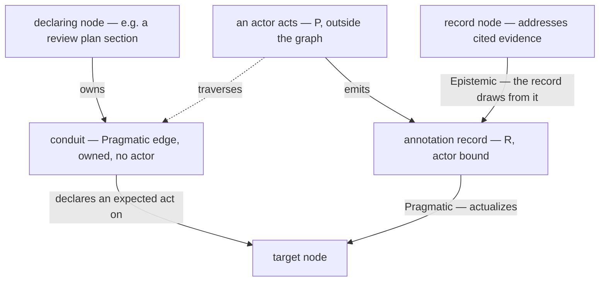
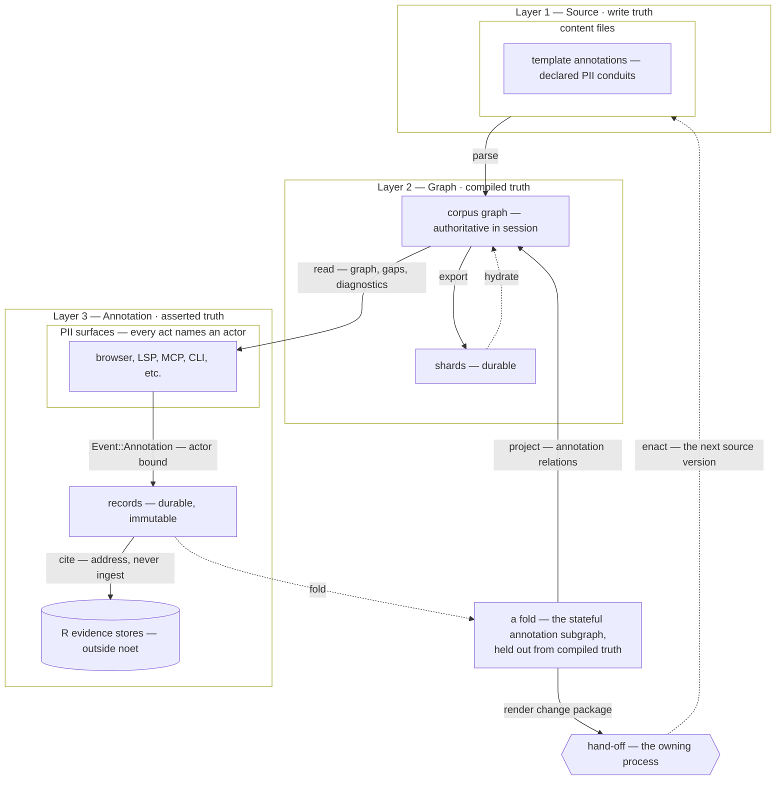

# The Living Corpus

> [!NOTE]
> **This document describes a target architecture.** The Layer 1 → Layer 2 path
> is implemented and in production use. Most of Layer 3, and the return path
> from Layer 3 to Layer 1, are designed but not built. §9 maps every element to
> either an implementation site or the issue that will build it — read it as the
> ground truth for what exists today.

## 1. Purpose

`architecture.md` explains how noet compiles documents into a graph. It stops at
the compiled artifact. This document describes what happens *after* — how a
compiled corpus becomes something people work in rather than something they read.

A compiled corpus is a dead artifact. It answers questions but records nothing
about the asking. A reader who spots a gap, a reviewer who approves a section, an
engineer who marks a requirement as needing work — none of that survives the next
build. Yet those acts are what turn a documentation set into an operational one.

Three commitments define the architecture:

1. **Annotations live on top of the source, not in it.** They are assertions
   about content, not content. Putting them in source would make every comment a
   commit and every reviewer a committer.
2. **Assertions and mutations are different kinds of thing.** Conflating them is
   the design error this document exists to prevent.
3. **The loop must close.** An annotation that cannot become a change is a
   suggestion box. The path from "this is wrong" to "this is fixed" is the point.

**Scope.** This document owns the layer model, the assert/mutate boundary, and
the annotation loop. It does not specify the record schema
(`beliefbase_architecture.md` §4.3), the general provenance model
(`attestation_fabric.md`), or how a corpus is shared between people and machines
(`federated_belief_network.md` — which is mostly a Layer 3 concern, since Layer 1
sharing is git's job and Layer 2 is derived from Layer 1).

---

## 2. Three Layers

```
Layer 3: Annotation          "What have people claimed about the content?"
  Immutable authored claims, multi-writer, append-only
  Durable: sidecar files · Live: derived state (a fold)

Layer 2: Belief Graph        "How does the content relate?"
  Typed multigraph, single-owner-per-node
  Durable: shards · Live: in-memory graph

Layer 1: Source              "What content is in the data?"
  Filesystem, git
  Durable: the files themselves — the write truth
```

**Federation is primarily a Layer 3 protocol**, because Layer 3 is the only layer
that cannot be derived or shared by existing tooling — L1 is git's job, and L2 is
a pure function of L1. See `federated_belief_network.md` §1.1.

**Why three and not two.** Layer 1 and Layer 2 are related by *compilation* — a
deterministic function from files to graph. Layer 3 cannot be compiled from
Layer 1, because its content does not exist in the files. It is a separate input
with a separate lifecycle, separate ownership, and separate durability.
Collapsing it into either neighbour produces either "every comment is a commit"
(folded into L1) or "annotations vanish on rebuild" (folded into L2).

**Layer 3's substrate is not a CRDT library.** Layer 3 is a set of immutable
records with globally unique IDs, which is a **G-Set** — merge is set union,
conflicts are impossible by construction. Automerge remains relevant only for
character-level concurrent text editing, which is out of scope. See
`federated_belief_network.md` §2.3.

**Layer 3 holds a privileged subset of `R`.** Every annotation *is* an as-run
record (`R` in `../essays/engineering_model_ontology.md` §3.4) — an observation
pinned to a moment, immutable once made. §3.4 says so directly: "an automated test
pipeline is as much a `P`-identity as a human reviewer; both require
characterization for the resulting `R` to be interpretable." A review is `P`
acting on `S`; the record of it is `R`. There is no separate category.

What distinguishes an annotation is not its kind but its **subject and its
volume**:

| | Annotation | General `R` |
|---|---|---|
| Subject | a node in *this* graph | the world |
| Produced by | a `P` that is usually human, always identified | any `P`, often machine |
| Volume | one per deliberate act — human-scale | unbounded |
| Individually meaningful | yes — it is attributable and disputable | rarely; value is in aggregate |
| Projects into the graph | as a node plus edges | as a *summary*, cited |

The privilege is architectural: because an annotation names a node in this graph
and arrives at human scale, it can be stored, projected, and queried
individually. A telemetry stream cannot — not because it is a different kind of
thing, but because a million of them would flood a store sized for deliberate
acts and a graph in which every node is addressable.

So the operative rule is unchanged even though the taxonomy is: **test results,
telemetry, and build logs stay outside the annotation store and must not each
project into a graph node.** They connect by **citation** — an attestation claims
something and cites `R` as evidence via `caused_by` / `evidence_hash`
(`attestation_fabric.md` §4.2a). What a citation points *at* is §8.

Calling an annotation "disputable" and general `R` "not wrong" is a distinction
about *subject*, not epistemics: a measurement can be mis-contextualised and a
review can be mistaken, but only the review makes a claim about something the
graph contains. See also `beliefbase_architecture.md` §4.3.

**Layers 2 and 3 reach "no conflicts" by different routes**, which is why they are
separate layers rather than one log:

| | Layer 2 | Layer 3 |
|---|---|---|
| Entries | mutations — order-dependent | assertions — order-independent |
| Ownership | one writer per node | many writers, uncoordinated |
| Merge | replay in order | set union |
| Conflicts avoided by | partitioned ownership | immutability |

A rename followed by a content update is not the same as the reverse, so Layer 2
must replay in order. Layer 3 records are immutable, so order affects only
presentation. `federated_belief_network.md` §2.3 develops this for peer
replication.

### Layer 3's live projection is a held-out BeliefBase

"Derived state" above is deliberately vague. Made precise: **the annotation
layer's live projection is a held-out BeliefBase — in essence a diff applied to
its root corpus context.** Fold the records, project them (§4), and apply the
resulting `BeliefEvent`s into a graph held *separately from* the compiled one.

> **[`overlay_model.md`](./overlay_model.md) §2 is authoritative for the
> projection's concrete form.** In one sentence: **an annotation does not modify
> the nodes it concerns — it is a node that owns edges into them**, the
> third-party ownership `{maps_to}` already uses. That is what makes the overlay
> compose without a merge, and §2 gives the mechanism, the rejected alternatives,
> and the `union_mut` constraint behind it.

Reading the corpus with annotations live is reading the compiled graph with that
overlay continuously merged on top; reading it without is dropping the overlay.
Nothing is written into the compiled graph to make the first true, and nothing
is undone to make the second.

**Projection, then diff — both, in that order.** These are two operations at two
layers, not rival framings of one. Projection is **additive and universal**:
folding records and projecting them sprinkles context onto the corpus graph, and
nothing is removed or rewritten. A **redline** goes a layer further — its payload
carries proposed content which parses into a *candidate graph*
(`identity/generational_archive.md` §6.1), and comparing that against the base is
where mutations and removals of nodes *and* edges appear. Reading an annotated
corpus exercises only the projection; rendering a change package exercises
fold → project → parse → diff.

**Comparison is therefore native to the annotation layer, not machinery borrowed
for it.** Reading the overlay is comparing "corpus" against "corpus + overlay",
and the delta is the halo. Issue 74's `Diff` render mode is the surface for both
depths; Issue 74 owns what the redline case demands of it.

**This is §3's pattern, not an exception to it.** Sidecar records are the durable
store, the held-out graph is the live projection, and the fold is the rebuild —
so the loader that hydrates shards into a graph is the loader that hydrates
records into the overlay. That is the "same loader" §3 argues for, made concrete.

**The overlay is downstream of interpretation, never a bypass around it.** It is
*produced by* folding annotations; it is not a place annotations are written. An
`Annotation` remains a claim requiring interpretation and a `BeliefEvent` remains
an instruction the store applies directly; the fold is still the only bridge
between them (§4; `beliefbase_architecture.md` §4.3). Read "the annotation layer
holds a BeliefBase" as "the projection's output is a graph" — never as
"annotations are BeliefEvents".

**The annotation server is this overlay plus the machinery that maintains it** —
scoping (§6), persistence (Issue 105), and propagation between scopes and peers
(`federated_belief_network.md` §1.2). It holds a BeliefBase out; it is not one.

---

## 3. The Same Pattern, Three Times

Every layer is a **durable store plus a live projection**:

| Layer | Durable store | Live projection | Rebuild operation |
|---|---|---|---|
| 1 | source files | text editor | — |
| 2 | shards | in-memory graph | hydrate |
| 3 | sidecar records | derived state | fold |

The projection is always reconstructible from the store, and the store is never
queried directly. This is why:

- `noet serve` can be stateless between restarts — the graph rehydrates from
  shards rather than from a persistent database.
- Annotation state (is this todo open? is this signed off?) is never stored, only
  computed. A close is a *new record* citing the original, never an edit.
- The same loader should serve both. The annotation store hydrating into the live
  graph is structurally the shard loader with a different input; writing a second
  one would duplicate a solved problem. This holds precisely because Layer 3's
  live projection is itself a graph — a held-out BeliefBase (§2) — and not a
  bespoke state object.

Recognising the pattern once prevents three independent implementations of it.

---

## 4. Assert vs. Mutate

The central type distinction:

```rust
pub enum Event {
    Ping,
    Belief(BeliefEvent),        // mutation — "the graph now contains this"
    Annotation(Annotation),     // assertion — "someone said this about that"
}
```

A `BeliefEvent` is an *instruction*: the store applies it directly. An
`Annotation` is a *claim*: it must be interpreted before it affects anything.

**Assertions project into mutations, never the reverse.** Folding an `Annotation`
emits `BeliefEvent`s per the mapping in `attestation_fabric.md` §12.3:

| Annotation aspect | Becomes |
|---|---|
| the record itself | `NodeUpsert` |
| `caused_by` / provenance link | `RelationUpdate` (Epistemic) |
| coverage assertion | `RelationUpdate` (Pragmatic) |

§5 gives the edge-by-edge form and why each edge carries the kind it does.

This table covers the annotation kinds specified today, which are all *additive*
— they assert something new about existing content. It is not the limit of the
projection. `BeliefEvent` also carries removal, rename, and ordering
(`PathUpdate` takes an order vector), so an annotation kind that repositions or
supersedes content projects into those. The general form is a **diff**: fold the
records, compare the result against the compiled corpus, emit the difference.
Authoring new content is the case that requires it — see §5.

The consequence: **consumers that only care about graph state never see an
`Annotation`.** They subscribe downstream of the projection. Only consumers
needing annotation semantics — sign-off summaries, open-todo lists, compliance
gap queries — read records directly.

This is why annotations are not variants of `BeliefEvent`. Every existing
`BeliefEvent` variant is something the accumulator applies; an annotation is not.
Merging them would force every `match` in the apply path to carry arms for events
it cannot apply.

### How records are issued

A record enters the system through the **annotation channel**
([`annotation_channel.md`](./annotation_channel.md)): a producer opens a handle
with an `ActorId`, calls `emit` with a typed payload and an anchor, receives the
`EventId` the handle minted, and closes. The producer never sees the store. The
parse pipeline, a browser session, and an MCP agent are three clients of one
API, differing only in actor and sink.

The layer this document describes can therefore be read end to end as **a system
for issuing, moving, and semantically enhancing log-type records**: the channel
issues them, the stores hold and move them (§6, `collector_model.md`), and the
fold and the anchor make them stateful. Which compiler observations become
records — rather than staying node `metadata` or going out as plain
diagnostics — is the producer's choice of lane, decided per observation
(`annotation_channel.md` §3, §7).

### Anchoring

An annotation names what it is about with `(target, target_version)`, where
`target_version` is a content hash — not a build identifier. Editing one node
does not stale annotations on another.

In the common case the target is a single node and the version is its content
hash. The general form is broader, because a target can be a *scope* rather than
a node; the rest of this section builds up to it.

**`record_kind` selects the staleness semantics, not just the schema.** An
annotation asserts about a *scope*, and different kinds legitimately assert about
different ones — so a node carries a family of hashes rather than a single
version, and the record kind picks which one it anchors to:

| Claim | Scope | Hash |
|---|---|---|
| "I proofread this paragraph" | the node's own fields | `content_hash` (radius 0) |
| "I reviewed this section" | Section containment | `section_hash` (radius ∞, Section) |
| "I verified this requirement" | the reasoning chain behind it | radius ∞ over Epistemic |
| "I signed off on this and its direct dependencies" | one hop | radius 1 |

Two annotations on the same node, by the same actor, at the same instant, can
stale differently — because they claimed different things. The verification case
is the one that makes this necessary rather than elegant: a requirement's own
text can be untouched while the evidence supporting it has moved, and only an
Epistemic-scoped anchor detects that.

Underneath, a scope is a **query**, and that is the general form the opening
paragraph pointed at: an anchor is `(QuerySpec, tape_hash)` — the query defining
what was looked at, paired with a hash over what it returned. `target` is the
query; `target_version` is the tape hash. A single node is the degenerate case,
where the query selects one node and the hash is its `content_hash`. The named
hashes above are the precomputed cache of the common scopes; a filtered scope
("I reviewed all Class-A items under §3") is an ordinary query with no cached
field.

Specified in [`content_versioning.md`](../identity/content_versioning.md), which is
authoritative; this table is orientation.

### Annotations are stateful, and the state machine is per-kind

An annotation is not a one-shot fact. A todo is opened, perhaps reassigned,
eventually closed — or abandoned. A sign-off is given, and may later be revoked
or go stale when its anchor changes. A redline is proposed, then accepted or
rejected. **Each annotation kind has its own lifecycle**, and they do not share
one.

This composes with immutability rather than fighting it. Records are never
edited; a transition is a *new record citing the prior one* via `caused_by`. The
current state is the fold over that chain — §3's pattern applied to Layer 3.

```
  record: open        record: assign      record: close
     │                     │  causes ┐        │  causes ┐
     └─────────────────────┘─────────┘────────┘─────────┘
                            fold → state: closed
```

A fold needs a **transition function**. Hardcoding "open/closed" per directive
does not survive contact with the next requirement, so the function is declared
rather than compiled in — Issue 104 registers it per kind.

**The state machine is a procedure, referenced by the protocol registry.**
`attestation_fabric.md` §6 resolves a `record_kind` to a check specification, a
node schema, and a `graph_roles` block declaring which edges a record of that
kind emits. For the lifecycle it carries a **`NodeVersionRef` pointing at an
authored lifecycle document** — *not* an embedded `[protocol.states]` block.

That is deliberate, and §6 is authoritative for it. A lifecycle document declares
steps whose **exit predicates and outcomes** *are* the transition semantics
(Issue 17). Embedding a second state-machine grammar in registry entries would
give one concept two schemas, two parsers, and two ways to drift. Referencing one
instead means the lifecycle is a first-class graph node — versionable,
reviewable, and annotatable like any other content, which an inline TOML block
could never be.

That is also what makes **custom annotation kinds** tractable. The
`local:<team>:<name>:<ver>` namespace of §6.2 already anticipates team-defined
protocols that are valid but not portable; a team defines a review workflow — say
`local:safety:hazard-review:v1`, a markdown document whose steps run
`draft → peer-reviewed → board-approved` — and points a registry entry at it. No
code change, and the definition travels with the corpus.

**Where such a document lives is the corpus author's decision, not this
architecture's.** A lifecycle document is an ordinary markdown document carrying
`{exit}` and `{outcome}` directives (Issue 17), so it sits wherever the project
puts its documents and is reached by the same `NodeVersionRef` from anywhere. The
same holds for a template annotation: whether it is authored as a `{maps_to}`-style
directive, implied by a frontmatter `sign_off_policy`, or generated from a schema,
all three routes produce the same graph structure, and nothing downstream can tell
which was used. Keeping the registry entry a reference rather than an inline block
is what buys that indifference.

> **A rejection path is an outcome that clears marks.** Step state is a marking,
> not a position: an outcome of `rejected` on the review step clears the marks of
> the draft steps, so `peer-reviewed → draft` needs no back-edge and no
> transition construct. A repeated cycle produces an identical marking, so the
> state space stays bounded by the document. Issue 17 owns the grammar.

**There are two state mechanisms, not one.** A `{todo}` closing and a sign-off
going `stale` are both transitions, but they differ in what drives them:

| | Bracketed operation | Derived condition |
|---|---|---|
| Example | executing a review procedure | a sign-off going `stale` |
| Driven by | actor records | the world changing underneath |
| Transition trigger | a record arrives | a hash comparison at fold time |

The second needs nothing beyond the record chain and the current node hash. The
first does: an operation with duration produces *several* records, and in an
unordered append-only log nothing groups them — two concurrent executions of the
same procedure on the same node would interleave indistinguishably. The mechanism
is a `RunStart`/`RunEnd` bracket carrying a `run_id` that the fold partitions on,
with the `RunStart` citing the procedure template whose states and transitions
govern it. A `RunStart` may also cite an enclosing `run_id` via its
`enclosing_run` field, so runs nest — a sub-effort spawned from an in-progress one, with that
link projecting as a Section edge toward the enclosing run: containment, not
citation (§5). **Issue 105 owns this**; do not force staleness through the
bracket.

Two constraints hold regardless:

- **An unknown protocol degrades, never fails.** `attestation_fabric.md` §6.2
  already establishes this for attestations: an unrecognized `local:` protocol is accepted and recorded as
  `unrecognized_protocol`, never silently dropped. Annotation kinds must behave
  the same — a record whose state machine is unavailable is still readable, still
  merges, and simply has no derived state.
- **A transition the state machine forbids is a diagnostic, not a rejected
  write.** The store is append-only and its merge is set union; refusing a write
  would break both. An illegal transition is surfaced by `check_consistency`, in
  the same register as a broken evidence citation. It is judged after a merge the
  writer could not see, which is why it cannot be an admission decision — but it
  is not toothless either: whether a run's transitions were legal is a fold
  output, so a promotion predicate can require consistency before a record
  crosses a store boundary. **Gate movement, not storage** (Issue 105
  §Promotion reads the fold).

---

## 5. Conduits: Potentialized and Actualized Annotations

The assert/mutate split raises a question the graph model alone does not answer:
what *is* a Pragmatic edge, in a representation that is inert?

`../essays/engineering_model_ontology.md` §3.3 defines `P` as the causal agent —
"a test engineer exercising a test procedure, a CPU executing a binary … each is
`P` acting on `S`." It also says what `P` is *not*: "the written procedure, the
source code, the test plan — these are not `P`. They are structural content whose
subject is execution: $S_P$." And its footnote closes the loop:

> We never observe `P` directly — we observe $S_P$ (structural descriptions of
> execution) and `R` (the effects of execution). **`P` itself is the gap between
> the two.**

A compiled graph is inert. It therefore cannot contain `P`. What a Pragmatic edge
holds is $S_P$: a **declared conduit** along which an actor is expected to act.
The actor acting is `P`, which happens outside the graph. The annotation the actor
emits is the `R` proving it happened.

This is why annotations are **PII-first**: every annotation names an
observer/actor, because an annotation without one would be evidence of an
execution nobody performed. The `actor` field is not bookkeeping; it is what makes
the record `R` at all.

A graph can therefore declare conduits that **nothing has yet traversed**. These
are *potentialized annotations* — the `int main()` of the corpus: declared entry
points for expected observer/actor operations.

| State | Shape | Meaning |
|---|---|---|
| Potentialized | a **node** declaring an expected act — no edge, nothing to sink | "an actor of this kind is expected to act here" |
| Actualized | a Pragmatic edge from that node to a run | "this actor did act, and here is what resulted" |

The asymmetry is deliberate. A declaration cannot be an edge because it has no
second endpoint — the run it anticipates does not exist yet. It is a surface the
corpus can be queried against: *what kinds of run does this corpus know how to
start, and which of them has anything started?*

**Revocation needs no special edge semantics.** A revoking record is an ordinary
record citing the act it withdraws, so the log holds the whole sequence and the
fold decides what the projection shows. Whether a promoted summary carries the
withdrawn act or only the net outcome is a **promotion configuration** — the log
keeps the journey, the summary states what is (`ISSUE_105` §Promotion reads the
fold) — not a property of the edge or of the conduit.

**A conduit may name a role rather than an actor**, and several actors can
discharge it. "2 of 3 reviewers" needs no conduit-level state machine: it is
`{exit} n-of :count: 2` over a queryset resolving the role — Issue 17's existing
combinator applied to actors instead of steps. That is the same primitive Issue
17 factors out for inputs, **coverage of a declared set by a discharged set**, in
its agential tense: the declared set is the role ($S_P$, no actor bound), the
discharged set is the actors who emitted runs ($R$), and the exit predicate is
the comparison.

So the two tenses hold throughout: a **procedure cites a role**, a **record cites
an actor**. A record may also cite another *actor* to bring them into the run's
scope — the agential counterpart of citing an input, and Pragmatic for the same
reason, where an evidence citation is Epistemic (Issue 17 §Combinators).

Several features already in flight turn out to be this same object:

- A **`{todo}`** is a potentialized annotation — a declared act with no actor yet.
  Closing it binds an actor and produces the `R`.
- A **sign-off policy** in frontmatter (Issue 65) declares which credentialed
  actors are expected to act on a node: a potentialized annotation with a type
  constraint on the actor.
- A **procedure** (Issue 17) is a potentialized annotation with steps — $S_P$
  awaiting a `P`.

### The mechanism already exists: owned edges

A declaration has two parts, and only one of them is an edge.

**The declaration itself is a node** — a template annotation carrying
`record_kind` and actor constraints. It has no run to point at, so nothing about
the *expected act* is edge-shaped.

**What it may additionally own is scope**: a `template_annotation → target` edge
naming which nodes the act is expected *on*. That part is third-party ownership
in the `{maps_to}` sense — `mapping_node_architecture.md` §1: "the `{maps_to}`
directive lets any section or document node own directed edges between two other
nodes **without being either endpoint**. The owning node is a third-party
observer." Ownership is carried by `WEIGHT_OWNED_BY` (`src/properties.rs:626`).

The distinction matters because the two answer different questions. The node
answers *what kind of act is expected*; the scope edges answer *on what*. A
template with no scope edges is still a valid declaration — a run kind the corpus
knows how to start, awaiting an anchor supplied at `RunStart`.

So the conduit needs no new primitive, and the scope half inherits three
properties that would otherwise need designing:

- **Authoring** — a fenced MyST block with a TOML body, the pattern authors
  already use for traceability.
- **Lifecycle** — the owner is "responsible for the lifecycle of those edges"
  (`mapping_node_architecture.md` §1). Delete the declaration and the conduits go
  with it. A potentialized annotation is therefore never orphaned.
- **Query** — `get_maps_to_traceability` already walks owner → sink → sources.
  "Which nodes has this plan declared an act on, and which have one?" is the
  existing traceability query with annotations as the coverage set. The
  complementary question — *which declared run kinds has nothing started* — is a
  node-level absence over templates, not an edge complement.

**What the template node carries.** A declaration must say more than "an act is
expected here" — it must say *what kind*, so the gap query can distinguish an
unreviewed node from an untested one, and so an actor can tell whether their
credential applies. That payload is the second reason a declaration is a node:
an edge has nowhere to put it. A template annotation is a record with `record_kind` and
actor constraints bound, but `actor`, `observed_at`, and `result` absent — the
same record schema as an actualized annotation, minus what only execution can
supply. Actualization fills the holes.

A template is therefore authorable in source while an actualization is not, which
is consistent rather than contradictory. Declaring *that a review is expected* is
a normative statement about the corpus and belongs in version control. Recording
*that a review happened* is evidence and belongs in the annotation store.

**This constrains where `R` may enter the graph.** A record node (§8) may exist
*only* as evidence cited by an annotation — never free-standing. Without that
rule the graph becomes a log index: record nodes accumulating with no actor and
no claim, which is the flood the claim/evidence split exists to prevent. Evidence
enters the graph only through an act someone is accountable for.

### Actualization



The dotted arrow is the one thing the graph can never contain. `P` is "the gap
between" $S_P$ and `R`: the conduit is the structural description, the record is
the effect, and the act itself is unobservable — not merely stored elsewhere, but
inaccessible in principle. No amount of instrumentation recovers it; the moment an
act is recorded it has become `R`.

**Gap analysis falls out as a plain graph query.** Both sides are
graph-resident: the declaration arrives by parsing source, the actualization by
the record → `BeliefEvent` projection (§4), which `noet serve` performs once and
all consumers read downstream of. The question takes two forms and both are
ordinary. *Which declared run kinds has nothing started?* is a **node-level
absence** — templates with no incident actualization edge. *Which declared
targets have no act on them?* is the **edge complement** `attestation_fabric.md`
§12.1 describes for coverage. Neither joins two data sources at query time, and
neither needs special-casing in the query layer. A corpus states not
only what it contains but what work it expects, and the difference is computable.

The projection is what buys this. Without it, every consumer would mux records
against the graph independently and have to agree on how — the five-schemas
problem in a different costume.

### Which edges an actualized annotation emits

Given the conduit model, the natural reading is that an annotation is *Pragmatic
throughout* — it is, after all, the actualization of a Pragmatic conduit. That is
nearly right, and the exception is exact: getting it wrong breaks the per-kind
acyclicity invariant the stratified hashing depends on.

An annotation emits edges of **all three** kinds, and which is which follows
from what each edge asserts. The run node the fold projects
(`ISSUE_105` §Project) is the source of every one of them:

Direction is not uniform, and the split is the point. A run **reaches into** the
nodes it concerns — it injects context those nodes did not carry, so the run is
the *source* there, which is `overlay_model.md` §2's self-owned mode and the
shipped semantics. A run is **conditioned by** everything it derives from — its
actor, its template, the records it cites — so it is the *sink* of those. And a
nested run is a *part of* its enclosing run, which follows the ordinary Section
convention that the contained node is the source.

| Edge | Kind | Why |
|---|---|---|
| actor → run | **Pragmatic** | the actor *performed* this run; delete the actor and the run is unattributable |
| run → the nodes its anchor selected | **Epistemic** | the claim *draws from* the set the `QuerySpec` returned, and reaches into each member — self-owned, `WEIGHT_OWNED_BY = "source"` |
| the procedure it follows → run | **Pragmatic** | the run is *executing* that template — delete the template and the run is meaningless; the conduit the `RunStart` actualizes |
| nested run → the run enclosing it (`enclosing_run`) | **Section** | containment, not citation — the contained node is the source, as with `composed_of` |
| a prior record (`caused_by`) → run | **Epistemic** by default | a close, revoke, or reply reasons *from* what it cites, and cannot stand without it |
| a cited record node → run | **Epistemic** | "this claim draws from that evidence" — provenance |

**Why the anchor edge points the other way from the rest.** Deleting a node the
annotation concerns does orphan the claim — but that is the *anchor*
(`(QuerySpec, tape_hash)`), which needs no edge to express. The edge expresses
something else: an annotation **adds context a node did not have**. A receipt does
not make a section what it is; it adds "someone read this" to what the section
already carries. That is additive, where a template is constitutive of the run
executing it. The closure hashes depend on this orientation — a node's Epistemic
closure must pick up annotations about it, which is the constitutive-constraint
case `content_versioning.md` §5 describes.

**The actor is a graph node.** The edge is
`(source: actor, sink: run, WEIGHT_OWNED_BY: actor)` — the same orientation as
every other row, since the actor is what the run proceeded *from*. It also keeps
a prolific actor out of the way of halo propagation, which fixes at the lowest
sink and therefore traverses *away from* a source hub rather than into it.

Ownership and endpoint are orthogonal fields, so "the actor owns this edge" and
"the actor is the source" are one consistent statement rather than two competing
accounts — `WEIGHT_OWNED_BY` admits source, sink, or a third party
(`mapping_node_architecture.md` §1).

Without this edge the actor is the one envelope field with no graph
representation, and "everything this person signed off" is a payload scan rather
than a traversal — the same argument that makes the anchor a real edge rather
than a field.

**Actor identity is derived, not minted.** **Issue 105 step 4 owns creating the
actor node**, alongside the run node it attaches to. An `ActorId` resolves to a
BID derived from an email address, so the same actor is the same node across corpora with no
coordination — `identity_derivation.md`'s rule that anything surviving a rebuild
must be derived. Distributed identity tokens — DIDs and equivalents — are the
natural later addition; the derivation rule is what makes them a substitution
rather than a redesign.

**One actor holding several addresses is an attested binding, not a frontmatter
field.** The `url_aliases` mechanism (`codecs/network_authoring.md` §8) composes
additively over one node and is the obvious reuse, but it is authored in a
document: using it on an actor node would let anyone with commit access claim
another actor's address and inherit their attributed records. An actor's
identity-bearing fields must derive from the authentication mechanism or be
signed by it (`ISSUE_112_CREDENTIALS_AND_PROMOTION.md`).

**Fan-out is bounded by promotion, not by the edge.** A prolific actor accumulates
one edge per run, but most runs stay in local logs that are out of scope for most
queries (§6). What a query sees is the promoted subset, so the hub is far smaller
in practice than the record count suggests.

Two things this table gets right that a two-kind split could not.

**The target edge is Epistemic, not Pragmatic.** An annotation's scope is a
`QuerySpec` evaluated lazily (`content_versioning.md` §4), so what it relates to
is *the set that query returned* — a claim about what it drew from, not an act
performed on each member. This matters for the closure hashes: coverage claims
and provenance stay in different subgraphs, and an annotation over a 200-node
scope does not manufacture 200 Pragmatic coverage assertions.

**`caused_by`'s kind is a record-kind assertion, not a fixed rule.** The relation
is one field on the `Envelope`; what it *means* structurally depends on the kind
of the citing record, and that translation is declared by the kind and applied by
the fold. A nested run's `enclosing_run` link is Section; a reply's citation is
Epistemic. `ISSUE_105` §Project is authoritative; Issue 104 registers the
translation per kind.

**Not every dependency between records is an edge.** An `ask` blocking a redline
from reaching `packaged` is the clearest case: the ask is a *sub-run* of the
redline's procedure, so its structural relation is already the Section link its
`enclosing_run` projects, and the blocking itself is a **fold predicate** — a
transition
precondition on the cited run's derived state, evaluated in
`caused_by`-topological order (`ISSUE_105` §Cross-run guards). Adding a Pragmatic
edge for it would encode in the graph what the lifecycle already decides, and
double-count a relation the Section link carries. A "redline" is a record kind's
payload, not a node; there is nothing for such an edge to point at.

**Where Pragmatic survives is procedure execution.** A run is Pragmatic toward
the template it follows — that is the conduit being actualized (§5), and it is
what makes "which declared reviews have happened" a coverage query. The conduit
model sharpens *that* relation; it never governed the annotation's relation to
its subject matter.

**A template is not an edge, and the actualization is not the same edge with an
actor bound.** Two reasons, and the second reframes what a declaration *is*.

The mechanical one: a procedure may be run many times. One edge gaining an actor
could represent at most one execution, so every subsequent run of the same
template would have nowhere to land. An actualization is therefore always a new
edge — `(source: template, sink: run)` — and the declaration is untouched by it.

The structural one: **$S_P$ is not an edge at all.** A template has no `RunStart`
to sink, because no run has happened; there is nothing for a declaration edge to
connect. What a procedure declares is a **queryable surface** — the set of run
kinds this corpus knows how to start. It is a node with steps, discoverable by
query, and it becomes an edge only when something actualizes it.

This narrows the gap query rather than weakening it. "Which declared reviews have
happened" is not a complement over edges; it is *templates with no actualizing
run in the reader's scope*, which is a node-level absence and the same shape as a
derived `gap` (Issue 104). Neither side needs the declaration to have been an
edge.

**Authoring new content needs no separate mechanism.** A redline is a map of
corpus-relative path to content (`identity/generational_archive.md` §6.1), so a
*new* document is a key not present in the base and a *new section* is content
written where it goes. Both anchor to `(path, base_corpus_version)`, which every
redline already carries — a path needs no referent, so it may name a file that
does not exist yet. A new **network** is the same shape: the path is
`subnet/index.md`, and the `documents` table (Issue 103 Part C) carries its
ordering. What a redline cannot create is a **corpus**, since it names paths
relative to one; Issue 106 could change that if source write-back ever gains a
root.

This is why there is no draft-specific anchor. A positional triple would answer
"where does this fragment go?" — a question a file map never asks, because the
file *is* the position. What remains is a diff-quality problem: proposed content
that moves a section must render as a move rather than a delete-plus-add, which
is Issue 74's.

**The scope qualifier is load-bearing, not pedantry.** A generic procedure
included in several corpora accumulates runs globally, and a reader asking "has
this been done?" almost never means *anywhere, by anyone*. They mean: in this
application, for this program, by us. A template with a thousand actualizations
elsewhere and none here must read as a gap, or the query answers a question
nobody asked.

**This is constitutive constraint again** (`dag_model.md` §2). A generic
procedure has no gaps in itself — "is this done?" is not a question its own
content can answer. The *context* supplies the question: including the template
in an application corpus is what makes some particular absence count as a gap.
The template is unchanged by the inclusion; what it *means* is not.

Two things follow that the derivation reading alone would miss. A template's
`content_hash` is identical in every corpus including it, while its gap status
differs in each — so gap status is not a property of the node and must never be
cached onto one. And the same template can be simultaneously discharged in one
corpus and outstanding in another, with neither answer wrong, because the two
contexts constrain it differently.

**The halo supplies the mechanism**, and no new one is needed: which records
layer onto a corpus is exactly which stores a reader listens to
(`annotation_channel.md` §6). The gap query therefore ranges over the halo, not
over every record that exists. Two consequences follow, and they are worth
stating because they are easy to get backwards:

- **The denominator is corpus-scoped; the numerator is halo-scoped.** Templates
  come from the compiled graph — what *this* corpus declares. Actualizations come
  from the stores in scope. A shared procedure contributes its declaration to
  every corpus that includes it, while its runs stay wherever they were emitted.
- **Widening the halo can only close gaps, never open them.** Adding a store adds
  actualizations, so the gap set shrinks monotonically. That makes "why is this
  still a gap?" answerable by naming a store the reader is not listening to,
  rather than by auditing records.

**A corpus declares a default halo**, because coordination requires one. A team
has to agree on what counts as its sources of truth before "is this done?" has a
shared answer; without a corpus-side default, a compliance number is a property
of whoever ran the query and two readers disagree without either being wrong.
The default names the stores a reader should listen to for this corpus, and it
belongs in the annotation manifest (Issue 105) alongside `precedence` and
`ships`, which travels with the shards and is therefore reviewable — the same
argument §10 makes for declaring write authority in source rather than in a
gitignored setting.

**The default does not preclude individual manipulation.** A reader may widen the
halo to include their own scratch store, or narrow it to check what a subset
implies; that is the ordinary exploratory case and nothing gates it. What the
default buys is that the *unmodified* reading is the same for everyone, and that
a reader who has diverged from it can see that they have. Two details Issue 105
settles when it builds the manifest: whether a reported figure may be computed
from a widened halo at all, and how divergence is surfaced — since silently
computing against a different evidence set is the failure this exists to
prevent.

---

## 6. PII Surfaces

A **PII surface** (Personal Inspection Interface) connects a class of actor to
the corpus: it reads the live projection and writes into Layer 3. Inspection
names what the actor comes for; every surface below also emits, and one of them
reaches source (§7). The acronym is deliberately dual — it is also where user
identity meets what the user is shown.

**This section is authoritative for what a surface reads and writes.**
`attestation_fabric.md` §13 covers the attestation-service deployment concerns
(multi-tenancy, credentials, role-gated presentation); where the two describe the
same four surfaces, this table governs.

| Surface | Executor | Reads | Writes |
|---|---|---|---|
| Viewer | human, browser | graph + derived annotation state | comments, sign-offs, flags |
| LSP | human, editor | graph + diagnostics | annotations, source edits |
| MCP | AI agent | graph via structured query | agent actions |
| CLI | pipeline | graph | CI-emitted records |

All four share one shape: **read the live projection, write into Layer 3.** The
viewer row covers the deployed static site as well as a served one: it ships
WASM, so the fold and the halo query can run client-side against shards with no
server, and a browser store gives it somewhere to write. Whether that is
*implemented* is Issue 105 step 5's open constraint; what stands in the way
is measured in `generational_archive.md` §7 and owned by Issue 103 Part D.

None writes Layer 2 directly — the graph is compiled, not authored. Only the
write-back path (§7) reaches Layer 1, and it does so through the codec layer, not
around it.

This framing resolves what an LSP *is* in noet. It is not a compilation feature;
it is a PII surface that happens to live in an editor — a **shim** translating
annotations into diagnostics and hover, and editor actions back into records.
Code actions are annotations and source edits.

**Not every annotation is durable.** A compiler diagnostic is an observation
about a node by an identified `P`, anchored to a version — an annotation by §2's
definition — but it is *derived* from the current parse and regenerated on every
compile. Persisting it would put recomputable data in a store sized for
deliberate acts, which is §2's volume argument in a new form. The same holds for
inference findings, cursors, and presence.

**This is a scope, not a separate class.** The annotation store already has a
hierarchy — repo / user / shared (Issue 105) — with union reads and precedence
governing writes. Ephemeral records occupy a **regenerated scope** below repo:
the most local one. A diagnostic does not bypass the store; it lives in the
most-local store and never extends past it.

| Scope | Survives a rebuild | Typical contents |
|---|---|---|
| **regenerated** | no — replaced wholesale each parse | diagnostics, inference findings, cursors, presence |
| repo | yes, per corpus | receipts, redlines, judged gaps |
| user | yes, per person | cross-corpus annotations |
| shared | yes, synced | what a team has agreed to publish |

**Regenerated does not mean memory-resident.** These records are routinely
written to disk — compiler observations ship in the shard export so a browser
can read them with no server. What distinguishes the scope is not *where* the
records live but *who owns their lifetime*: the producing actor replaces the
whole set on its next run, so nothing outside that actor may depend on a
particular record surviving. A regenerated store on disk is a cache; a repo
store on disk is a record.

Two mechanisms govern movement, and both are **per-`record_kind`** properties
rather than special cases:

- **Staleness policy** — what a record does when its anchor version changes.
  A diagnostic is discarded (it will be recomputed); a `{reviewed}` is retained
  and marked stale. Declared alongside the anchor scope a kind already selects
  (`content_versioning.md` §3).
- **Flush** — promotion from a narrower scope to a broader one. A working record
  stays local until its run closes; then a summary promotes. This is the same
  operation as percolation across a federation boundary
  (`federated_belief_network.md` §1.2), which is why it should be one mechanism.
  A flush is therefore a **squash**: many constituent records in, one summary
  out, stating what the run concluded rather than how it got there. Issue 105
  §Promotion reads the fold gives the contract.

Regenerated records travel the same route, project the same way, and render
through the same surfaces as durable ones; the scope decides how long they
survive, not whether they participate. **Projection is uniform**: the fold
turns any run into a node of its own owning edges into its anchor set
(§5), so nothing derived is ever written *into* a corpus node — which is what
§4's assert/mutate boundary actually forbids. A diagnostic projects like a
receipt; it simply does not survive the next parse.

**The boundary is at Layer 1, not at the graph.** Records fold onto the graph
freely and may carry proposed changes as payload, but nothing folds arbitrarily
back into *source*. That path is Issue 106 — a deliberate tool, gated on declared
write authority per network and per codec, and in the common case still requiring
an actor to carry the change to whoever owns the target (§7). Flush semantics are
Issue 105's, since a flush is a form of close.

---

## 7. The Loop



The diagram is laid out by layer rather than by step: Layer 3 on top, Layer 2 on the
bottom, and the hand-off and Layer 1 sandwiched between them. That puts the two arrows
that actually carry the loop on opposite sides — **`read` goes up** from the graph to the
surfaces, and **`fold` comes back down** from the records to the graph.

Source compiles to graph: both its *content* and the *conduits* it declares. The graph
serves the PII surfaces. An actor at a surface emits an `Event::Annotation`. Records fold
into the annotation subgraph, which projects back into the graph, cites evidence held
elsewhere (§8, one-way), and — for records proposing a change — **renders a change package
and hands it to whatever process owns the target.**

The one node that is not a layer is the hand-off. It sits *between* Layer 3's records and
Layer 1's source, because that is the gap noet cannot close by itself. `enact` is dotted
and terminates at the next source version rather than at the file that produced this one —
the loop does not write back over its own input.

Three things the arrows say that a coarser reading would miss.

**The loop closes at a hand-off, not at a write.** A redline is a claim about a
*future* state of a document, and the authority to enact it belongs to that
document's owner — which is usually not noet and often not the redline's author.
So what closes the loop is a **rendered change package** delivered in the form
the owning process consumes: proposed text, rationale, the requirement driving
it, and the impact set. The redline then closes with a link to the submission.

Promotion is therefore **one operation with a variable boundary cost**, not two
different operations. What varies is who owns the target:

| Target | Owner | Promotion is |
|---|---|---|
| a matrix the analyst maintains | the analyst | a commit |
| a controlled procedure | a document-control process | a change request with named approvers |
| a design doc in another team's repo | that team | a contribution path, which may not exist |
| an upstream requirement | the requirements owner | a comment and a negotiation |

**Codec write-back is the special case where that boundary happens to be free.**
It is a genuine capability and worth having — it is how the analyst's own commit
gets automated — but it is an *exit*, not the definition of closure, and it is
the exit fewest real targets qualify for. It is also **not** a property noet can
assert about every corpus it reads: read access does not imply write authority,
so enactment is opt-in per network and per codec (§10).

**An unenactable redline is not a failure state.** When no automated path
exists, the redline still reaches `packaged` — the package is the deliverable,
and a human carries it across. This is the same shape as an `ask`, whose target
is a person or process rather than a node: both are records whose completion
depends on an actor noet does not control. Modelling the hand-off explicitly is
what lets the state machine represent "done, awaiting someone else" rather than
stalling.

**The dotted arrows are rebuilds or conditional**, not steady-state flow:
hydration and folding happen at startup and after invalidation, not per query,
and enactment runs only where authority has been configured.

---

## 8. Addressing Evidence

Layer 3 holds authored claims and cites `R` where it lives (§2). What does a
citation point at?

An attestation asserting "this requirement is verified, per runs 41–43" is only as
good as the ability to say which runs, in which store, and whether they still say
what they said. A citation that cannot be resolved or checked is a string.

noet has solved this shape once already. **Assets** are content the compiler
cannot parse but must address: a reserved namespace, a node carrying a
`content_hash`, and content-addressed handling — the bytes are referenced, never
absorbed. Evidence is the same problem one level out.

```
                    ┌─ Epistemic edge (draws from)
  Annotation ───────┤
  "verified per      │   Record node — an address, not a record
   runs 41-43"       └──   source_id · range · content_hash · summary
                                 │
                                 │  RecordSource: verify · summarize · locate
                                 ▼
                          the store — outside noet
```

Three properties make this work:

- **One node per cited span, not per observation.** Citing ten thousand telemetry
  samples produces one node. Graph size is invariant to evidence volume.
- **The primary operation is aggregation, not retrieval.** `../essays/engineering_model_ontology.md`
  §3.4: "statistics on `R` across the operating domain … constitute the model's
  credibility evidence." The interface returns summaries; fetching raw entries is
  opt-in and off the parse path.
- **Citations are checkable.** A cited span that has vanished, or whose hash no
  longer matches, is a consistency defect — the case that passes silently today.

**No new `WeightKind`.** A citation is an Epistemic edge: "this claim draws from
that evidence" is what Epistemic already means. `R` is the time dimension, not a
fourth content axis (§6.1 of the ontology), so encoding it as one would break the
N/S/P correspondence the three kinds carry — along with the per-kind acyclicity
invariant and the stratified hashing built on it.

The `RecordSource` interface is deliberately codec-shaped: `DocCodec` abstracts
"a format noet can parse into nodes"; `RecordSource` abstracts "a store noet can
address into citations." Both are registered, dispatched by a discriminator, and
implementable out-of-tree for domain-specific cases. Specified in **Issue 108**.

---

## 9. Architecture Map

Where each element of the diagram lives. Implementation sites are authoritative;
issues are listed only where nothing exists yet.

### Layer 1 → Layer 2 (implemented)

| Element | Implementation |
|---|---|
| parse pipeline | `beliefbase_architecture.md` §3.0; `codec::compiler` |
| codec frontend | `beliefbase_architecture.md` §3.6; `codec::DocCodec` |
| codec dispatch | `beliefbase_architecture.md` §3.2 (two-registry) |
| reference resolution | `beliefbase_architecture.md` §3.1; `codec::builder` |
| graph structure | `dag_model.md`; `beliefbase_architecture.md` §2.5 |
| identity | `beliefbase_architecture.md` §2.2; `properties::Bid` |
| batch commit | `beliefbase_architecture.md` §3.4; `beliefbase::accumulator` |
| store application | `beliefbase::sink::BeliefSink` (impls: `BeliefBase`, `DbConnection`) |
| shard export | `search_and_sharding.md`; `shard::export` |
| query | `query_model.md`; `beliefbase_architecture.md` §3.8 |

### Layer 2 durable ↔ live

| Element | Status |
|---|---|
| export → shards | implemented — `shard::export` |
| shards → live graph (hydrate) | **Issue 66** |
| per-node cached hash family | **Issue 66** step 1a |
| `(QuerySpec, tape_hash)` general form | unowned — `content_versioning.md` §9 |
| incremental skip | **Issue 66** |

### Layer 3

| Element | Status |
|---|---|
| record + envelope schema | decided — `beliefbase_architecture.md` §4.3; unimplemented |
| annotation channel (`open`/`emit`/`close`, two lanes) | **Issue 110** — `annotation_channel.md` |
| sidecar store, scope precedence | **Issue 105** |
| annotation vocabulary (`receipt`, `gap`, `redline`, `ask`) | **Issue 104** |
| procedure codec + `steps` schema (the template side) | **Issue 17** |
| `redline` / `ask` field sets, derived from real records | **Issue 17** step 2a — evidence for Issue 104 |
| run bracketing (`RunStart`/`RunEnd`, `run_id`, nesting, folding) | **Issue 105** |
| execution loop over a run — organizing, advancing, checking | **Issue 18** — aspirational stub, undesigned |
| record → `BeliefEvent` projection | `attestation_fabric.md` §12.3 (spec); **Issue 102** (owner) |
| multi-user sync peer | **Issue 65** |
| CRDT substrate | **Not needed** — immutable records with unique `id`s form a grow-only set, so merge is set union (Issue 16 closed as OBE) |

### PII surfaces

| Surface | Status |
|---|---|
| viewer | implemented — `interactive_viewer.md` |
| MCP | implemented — `docs/mcp.md` |
| server + consumer registry | **Issue 102** |
| LSP | **Issue 11**; needs **Issue 103** (source ranges) |
| CLI | implemented — `cli.rs` |

### Layer 3 → Layer 1 (the promote arrow)

| Element | Status |
|---|---|
| node source ranges (`Bid` → byte span) | **Issue 103** |
| codec write-back (`BeliefEvent` → source) | **Issue 107** |
| redline promotion | **Issue 106** |

### Evidence addressing (§8)

| Element | Status |
|---|---|
| reserved namespaces (Href, Asset) | implemented — `beliefbase_architecture.md` §2.4 |
| asset content-hash addressing (the precedent) | implemented — `codec::compiler` |
| `Record` namespace + record nodes | **Issue 108** |
| `RecordSource` / `RecordRange` | **Issue 108** |
| citation verification via `check_consistency` | **Issue 108** |

---

## 10. What Is Not Yet Bidirectional

The promote arrow assumes a capability the codec layer does not have. This is the
single largest gap between the model and the implementation, and it is easy to
miss because `DocCodec` *appears* to support write-back.

**Write-back today is parse-scoped.** `MdCodec::generate_source`
(`src/codec/md.rs:2543`) renders `self.current_events` — the event vector captured
during *that instance's* parse of *that* file. Mutations are applied to it during
`inject_context` by compiler-internal machinery: BID injection, link
normalization, frontmatter merge. Then the file is re-rendered.

```
FORWARD (general):
  source ──parse──> IRNodes ──builder──> BeliefEvent ──BeliefSink──> store

REVERSE (parse-scoped only):
  source <──generate_source── current_events
                                   ↑
                        same instance, same parse
```

**The reverse arrow never touches `BeliefEvent`.** There is no path from a graph
mutation to a source edit, and `BeliefSink` (`src/beliefbase/sink.rs`) has exactly
two impls, both stores. No codec can accept an event for a node it did not just
parse.

`BeliefSink` cannot be reused as-is, for three reasons:

| `BeliefSink` assumes | A codec sink requires |
|---|---|
| stateless apply | must load and parse the file first |
| events span all networks | events routed to the codec owning that file |
| opaque whole-store mutation | `Bid` → byte range to locate the edit |

The third is why **Issue 103 is load-bearing for write-back**, not merely an LSP
convenience.

A further distinction constrains what is achievable. **Content-expressed**
relations (`{maps_to}`, links) have a textual site that can be edited.
**Structural** relations (Section containment) do not — containment derives from
document position, so changing it means moving text, possibly across files. That
is document restructuring, not editing, and is deliberately out of scope.

### Write authority is configured, not assumed

Even once the mechanism exists, **the ability to parse a corpus does not confer
the authority to write to it.** noet reads generated corpora that a pipeline
overwrites, drafting copies whose controlled originals live elsewhere, and
repositories the operator can read but not commit to. Writing into any of these
is wrong by default, and wrong in a way the writer cannot detect locally — the
edit succeeds and is silently discarded, or succeeds and is unauthorized.

So enactment is **opt-in, declared per network and per codec**:

- **Per network**, because authority is a property of the corpus, not of the
  session. The declaration belongs in the network node's frontmatter payload,
  alongside `whitelist` / `blacklist` (`codecs/network_authoring.md`), which
  makes it **version-controlled and reviewable** — the same reason those live
  there. A `.noet/` setting would be the wrong home: it is gitignored, so the
  authority claim would not survive a clone and could not be reviewed.
- **Per codec**, because round-tripping is a codec capability. A codec that
  cannot regenerate source faithfully must not be asked to, and
  `CodecContentMode` already distinguishes text from binary.

This also subsumes the `--write` flag, which asserts the same authority as an
ephemeral command-line argument: invisible in review, easy to pass by accident,
and attached to the invocation rather than to the corpus it affects.

**Issue 107** builds the general mechanism; **Issue 106** turns a redline into an
edit through it. Until they land, enactment is unavailable — but the loop is not
blocked on them, because closure is the hand-off (§7) and the rendered change
package is what crosses it.

---

## 11. Deliberate Non-Goals

Work this architecture does not do. These need no owner because there is nothing
to resolve — unlike the calibration questions each issue carries, which belong
with the issue that will answer them rather than here.

**Character-level concurrent editing.** Two people typing in the same document is
a genuinely different problem from annotation merge, and it collides with source
being git-versioned Markdown edited in ordinary editors. Out of scope
indefinitely.

**Storing `R` itself.** As-run records — test results, telemetry, build logs —
are not in any of the three layers, and noet does not become a time-series store.
What noet *does* hold is **addresses of `R`**, a different and much smaller thing;
see §8. Materializing evidence into the graph stays out of scope.

**Structural mutation via write-back.** See §10.

**Writing back to non-source substrates.** §7's enact arrow targets Layer 1
source files via a codec. Staging changes outward to an issue tracker or a
spreadsheet is the read direction of external ingestion reversed — plausible,
and deliberately not planned. It is recorded as a **shape constraint** on
`SourceSink` (Issue 107 §`SourceSink`): keep the trait substrate-neutral so the
option is not foreclosed, and build nothing toward it.

---

## 12. References

- [`architecture.md`](../core/architecture.md) — the compilation half; this document is
  the other half
- [`dag_model.md`](../core/dag_model.md) — the three edge types, conceptually
- [`beliefbase_architecture.md`](../core/beliefbase_architecture.md) — Layer 1 → 2
  technical specification
- [`federated_belief_network.md`](./federated_belief_network.md) — sharing a
  corpus between peers; where the layer model originated (§3.7)
- [`content_versioning.md`](../identity/content_versioning.md) — scoped content identity;
  what a `version` anchor is and how scopes are computed
- [`attestation_fabric.md`](./attestation_fabric.md) — §4.2 record schema, §12.3
  projection, §13 PII surfaces
- [`annotation_channel.md`](./annotation_channel.md) — how a record is issued;
  the `open`/`emit`/`close` API and the two-lane split
- [`identity_derivation.md`](../identity/identity_derivation.md) — where an
  `EventId` comes from; minted versus derived identity
- [`mapping_node_architecture.md`](../codecs/mapping_node_architecture.md) — owned edges,
  the mechanism §5 builds the conduit on
- [`collaboration_overlay.md`](./collaboration_overlay.md) — the multi-user
  Layer 3 surface
- [`../essays/engineering_model_ontology.md`](../../essays/engineering_model_ontology.md)
  — §3.3 `P` and $S_P$, §3.4 as-run records
- [`beliefbase_architecture.md`](../core/beliefbase_architecture.md) §4.3
  — record schema and content hashing decisions
- [`../project/UX_AUDIT.md`](../../project/UX_AUDIT.md) §3.9 — the view-to-edit
  cliff, which this architecture answers
