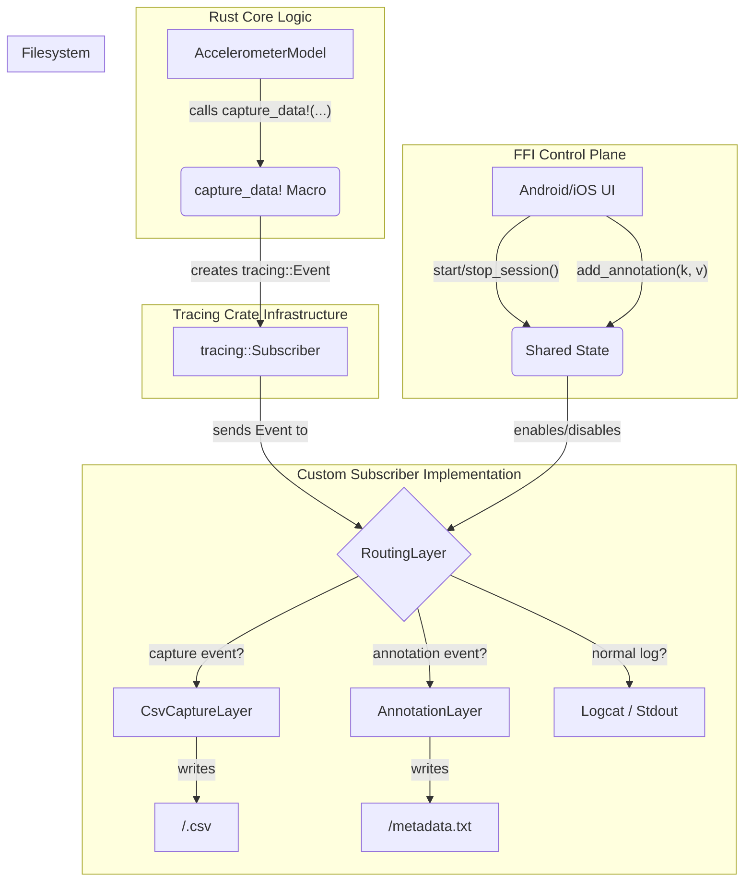

---
title = "Instrumentation & Data Capture System Design"
authors = "Andrew Lyjak, Gemini 2.5 Pro"
last_updated = "2025-10-27"
status = "Active"
version = "0.1"
dependencies = [ "development.md (v0.1)" ]
---
# Instrumentation & Data Capture System Design

## Purpose

This document specifies the design for a structured, type-safe instrumentation and data capture system built into the Rust core. It defines:

- The architecture for high-fidelity sensor data capture using the `tracing` crate
- The `capture_data!` macro interface for zero-cost instrumentation
- The `CsvCaptureLayer` subscriber for writing structured data to CSV files
- FFI control plane for session management from Android/iOS
- Integration with the calibration and testing workflow

This system enables capturing high-frequency sensor data for calibration, testing, regression analysis, and participant-facing analytics without impacting production performance or battery life.

## Core Principles

*   **Structure & Type Safety:** Data captured as strongly-typed, serializable structs
*   **Decoupling:** Application logic unaware of capture mechanism
*   **Performance:** Near-zero overhead when disabled
*   **Platform Agnosticism:** Built into Rust core, available to Android/iOS/desktop
*   **Scalability:** Extensible to new sensor modalities

## Architecture

The system leverages the `tracing` crate, repurposing it from a simple logging utility into a high-performance, structured data pipeline. We will separate the **instrumentation** (where data is emitted) from the **collection** (what is done with the data).



**Data Flow:**

1.  **Instrumentation:** Logic is instrumented with either `tracing::info!`, etc., for standard logs, or a `capture_data!(struct)` macro for high-frequency data, or an `add_capture_annotation(key, value)` FFI call for metadata.
2.  **Event Creation:** Each of these creates a `tracing::Event` with unique metadata identifying its type (e.g., `message = "NOET_DATA_CAPTURE"` or `message = "NOET_ANNOTATION"`).
3.  **Subscriber Processing:** The global subscriber receives all events and passes them to a custom `RoutingLayer`.
4.  **Routing:** The `RoutingLayer` inspects the event's metadata and forwards it to the appropriate sub-layer:
    *   **`CsvCaptureLayer`:** Handles `NOET_DATA_CAPTURE` events and writes them to type-specific CSV files.
    *   **`AnnotationLayer`:** Handles `NOET_ANNOTATION` events and writes them to a single `session_metadata.csv` file.
    *   **`fmt::Layer`:** Handles all other events and prints them to `logcat`/`stdout`.
5.  **FFI Control:** The entire process is managed by FFI calls that modify a shared `CaptureState` object, which is read by the layers to determine if they should be active.

## Schema

### capture_data! Macro Interface

This macro will be the primary interface for instrumentation.

```rust
// Usage
let sample = AccelerometerModelSample { ... };
capture_data!(sample);
```

**Implementation:**

It will be a declarative macro that:
1.  Takes a single argument: an expression that evaluates to a `serde::Serialize`-able type.
2.  Gets the type name of the expression.
3.  Serializes the data to a string (e.g., JSON).
4.  Emits a `tracing::event!` at the `TRACE` level with specific, structured fields:
    *   `header`: A constant string, defining the payload type (e.g. NOET_ANNOTATION, NOET_DATA_CAPTURE), joined with a key string, for data capture this key is the data structure name, for annotations it is the actual key.
    *   `data`: The serialized data string.

This structure allows our custom layer to easily identify and parse capture events.

**Note on Serialization Format (`JSON` vs. Direct-to-CSV):**

An alternative approach considered was to serialize the data directly to a CSV-formatted string within the macro. While this would remove one deserialization/re-serialization step in the subscriber, it introduces significant complexity, particularly around managing and writing CSV headers in a decoupled way.

The chosen `data_json` approach provides a self-describing, flexible format that simplifies the subscriber logic (e.g., header generation is trivial by inspecting the JSON keys of the first object). The performance cost of the JSON intermediate step is negligible for our use case but can be revisited if profiling identifies it as a bottleneck. A future optimization could involve a procedural macro to pass struct fields directly to the `tracing::event!`, eliminating intermediate serialization entirely, but this adds significant implementation complexity and is not necessary for the initial version.

### Serializable Data Structs

Any data we wish to capture must be defined in a struct that derives `serde::Serialize`.

```rust
// Example for the accelerometer
use serde::Serialize;

#[derive(Serialize)]
struct AccelerometerModelFrame {
    timestamp_nanos: u64,
    raw_accel_x: f64,
    raw_accel_y: f64,
    raw_accel_z: f64,
    gravity_x: f64,
    gravity_y: f64,
    gravity_z: f64,
    final_linear_x: f64,
    final_linear_y: f64,
    final_linear_z: f64,
    velocity_magnitude: f64,
    damping_factor: f64,
    is_moving: bool,
}
```

### CsvCaptureLayer Implementation

This is the core of the collection logic, implemented as a `tracing_subscriber::Layer`.

**State:**

```rust
struct CsvCaptureLayer {
    state: Arc<Mutex<CaptureState>>,
}

struct CaptureState {
    active: bool,
    base_path: PathBuf,
    writers: HashMap<String, csv::Writer<File>>,
    annotation_writer: Option<BufWriter<File>>,
}


**Note on Concurrency (`Mutex` vs. `RwLock`):**

The `CaptureState` is wrapped in an `Arc<Mutex<>>` to ensure thread-safe access from multiple `tracing` threads. A `Mutex` was deliberately chosen over an `RwLock`. While an `RwLock` can offer better performance in read-heavy scenarios, our workload is write-heavy. Every capture event requires a potential write to the `writers` `HashMap` (if a new type is seen) and an explicit write to a `csv::Writer`.

File I/O and buffered writers fundamentally require exclusive (`&mut`) access. A `Mutex` provides this exclusive access simply and efficiently. An `RwLock` would introduce significant complexity (e.g., handling lock upgrade contention from read to write) for no performance benefit in this write-oriented workload. For short, frequent critical sections like this, a `Mutex` is often the more performant and always the simpler choice.

**Logic (`on_event` method):**

1.  Lock the `state` mutex.
2.  Check if `state.active` is `true`. If not, return immediately.
3.  Check if the event's metadata matches our capture event signature (e.g., `message == "NOET_DATA_CAPTURE"`).
4.  If it's a capture event:
    a. Extract the `data_type` and `data_json` fields.
    b. If a writer for `data_type` does not exist in the `writers` map:
        i. Create a new file: `state.base_path.join(format!("{}.csv", data_type))`.
        ii. Create a new `csv::Writer` for that file.
        iii. Write the CSV header using the fields from the JSON data.
        iv. Insert the new writer into the map.
    c. Get the writer for the `data_type`.
    d. Deserialize the `data_json` back into a generic `serde_json::Value`.
    e. Use the writer's `serialize` method to write the value as a new CSV row.

### FFI Control Plane

Simple, clear functions will be exposed via UniFFI to allow the mobile UI to control the capture process.

```rust
// In the FFI module
fn start_capture_session(test_type: String) -> String; // Returns session ID/path
fn stop_capture_session();
fn add_capture_marker(marker_json: String);
```

*   `start_capture_session`: Creates a new timestamped directory for the session, locks the `CaptureState` mutex, sets `active = true`, and clears the `writers` map.
*   `stop_capture_session`: Locks the mutex, sets `active = false`, iterates through all writers, flushes them, and closes the file handles.
*   `add_capture_marker`: A dedicated function to log manual events from the UI (like "start_walk"). It will use `capture_data!` with a special `EventMarker` struct.

## Integration Points

### Calibration Workflow

The instrumentation system integrates with the calibration testing workflow:

```
┌──────────────────────────────────────────────────┐
│ Android CalibrationTestingFragment               │
│ • "Start Logging" button → start_capture_session│
│ • "Stop Logging" button → stop_capture_session  │
│ • "Export" button → zip session dir, share file │
└────────────────┬─────────────────────────────────┘
                 │
                 ▼
┌──────────────────────────────────────────────────┐
│ Rust Core (instrumented with capture_data!)     │
│ • AccelerometerModel                             │
│ • EventGatekeeper                                │
│ • DenStream clustering                           │
└────────────────┬─────────────────────────────────┘
                 │
                 ▼
┌──────────────────────────────────────────────────┐
│ Filesystem: <session_dir>/                      │
│ • AccelerometerModelFrame.csv                    │
│ • TriangulationEvent.csv                         │
│ • DenStreamMicroCluster.csv                      │
│ • session_metadata.csv (annotations)             │
└──────────────────────────────────────────────────┘
```

### Data Analysis Pipeline

Captured CSV files can be analyzed with:
- Python/pandas for statistical analysis
- Jupyter notebooks for visualization
- Regression test suites comparing sessions

## Implementation Roadmap

1.  **Dependencies:** Add `serde`, `serde_json`, `csv`, and `tracing-subscriber` with the `reload` feature to `Cargo.toml`.
2.  **Data Structs:** Define the initial `AccelerometerModelFrame` and `EventMarker` structs and derive `Serialize`.
3.  **FFI Stubs:** Create the `start/stop/marker` FFI functions and the shared `CaptureState` object.
4.  **`CsvCaptureLayer`:** Implement the custom `tracing_subscriber::Layer` with the logic described in section 3.3.
5.  **Subscriber Initialization:** In the Rust `main` or `init` function, set up the global subscriber using `tracing_subscriber::registry()`, adding the `CsvCaptureLayer`, a standard formatting layer for `logcat`, and a `reload::Layer` to control filtering.
6.  **`capture_data!` Macro:** Implement the declarative macro.
7.  **Instrument `AccelerometerModel`:** Add `capture_data!` calls at the end of the `process_accelerometer_reading` function to log the state.
8.  **Android Integration:**
    *   Wire the "Start/Stop Logging" buttons in `CalibrationTestingFragment` to call the `start/stop_capture_session` FFI functions.
    *   Modify the "Process and Export" logic to find the session directory, zip its contents, and share/export the zip file.

## Open Questions

1. **CSV vs. Parquet:** Should we support columnar formats like Parquet for large-scale analysis?
2. **Streaming to Cloud:** Should there be an optional mode to stream captured data to cloud storage for analysis?
3. **Automatic Annotation:** Can we auto-generate annotations from system events (GPS transitions, significant motion changes)?
4. **Binary Format Option:** For extremely high-frequency data, would a binary format reduce overhead?
5. **Cross-Session Analysis:** How to design identifiers and metadata to enable analysis across multiple sessions?
