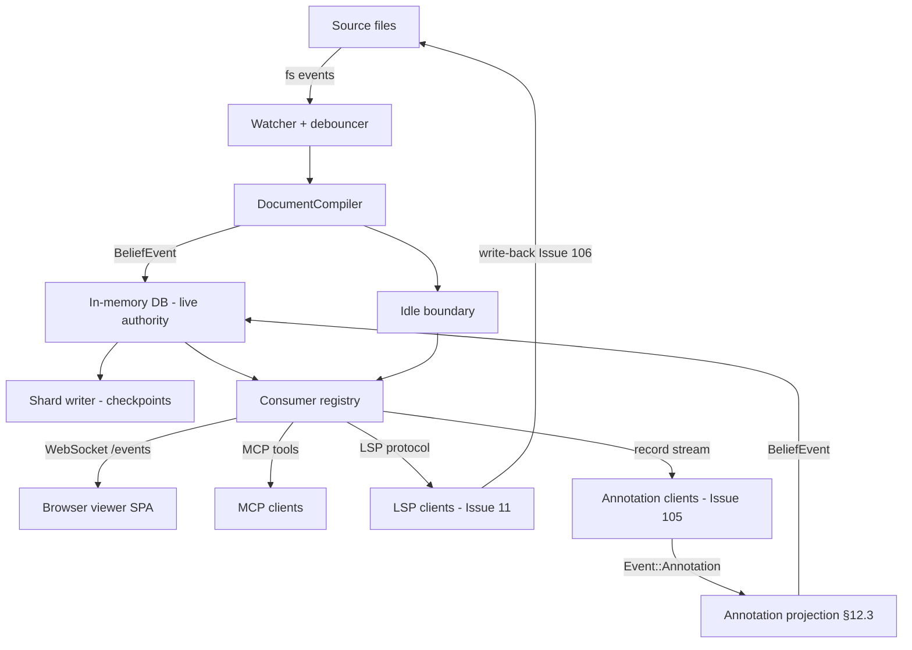

---
version = "0.1"
title = "Issue 102: noet serve — Unified Application Server"
---

# Issue 102: noet serve — Unified Application Server

**Priority**: HIGH
**Estimated Effort**: 3 days (RELATIVE COMPARISON ONLY)
**Dependencies**: Requires Issue 66 (shard hydration + `last_diagnostics`). **Informed by Issue 110** — it settles what the annotation projection lands in, which decides this server's write target (see Event routing). Blocks Issue 11 (LSP), Issue 65 (attestation server sync peer), Issue 104 (annotation vocabulary), Issue 105 (annotation sidecar store).

## Summary

`noet watch` is a compilation loop that happens to have a static file server
bolted onto it. Every consumer that needs the live graph — the browser viewer,
MCP, the LSP (Issue 11), the annotation client (Issue 105) — needs the same
three things from it: a subscription to change notifications, a query surface
over the in-memory DB, and a safe point at which the graph is quiescent. This
issue promotes `watch` into `serve`: a single long-running application server
that owns the live graph and multiplexes it to all consumers.

The rename is not cosmetic. Once Issue 66 removes `belief_cache.db`, the only
remaining difference between "watch" and "serve" is which consumers happen to
attach — and that is not a distinction worth two mental models.

## Goals

- `noet serve` replaces `noet watch`; `watch` survives one release as a hidden
  deprecated alias emitting a warning
- A consumer registry supporting concurrent viewer, MCP, LSP, and annotation
  clients with per-consumer subscription filtering
- A WebSocket `/events` endpoint broadcasting shard invalidation, replacing the
  current full-page-reload SSE and superseding Issue 41
- `Envelope`-wrapped event routing per `docs/design/core/beliefbase_architecture.md` §4.3,
  with the server owning the `Record -> Vec<BeliefEvent>` projection step
- An idle boundary that accounts for in-flight queries from **all** registered
  consumers, not just the compiler

## Architecture



### Command taxonomy

| Command | Lifetime | Owns |
|---|---|---|
| `noet parse` | One-shot; exits when done | Batch compilation, shard + HTML output |
| `noet serve` | Long-running | Live in-memory graph, file watching, viewer + MCP + LSP + annotation consumers, write-back |
| `noet watch` | Deprecated alias for `serve` | Nothing; warns and forwards |

Both `parse` and `serve` share Issue 66's cold-start hydration model. The
difference is that `parse` exits after the first pass and `serve` keeps the DB
alive as the authoritative query surface for the session.

Deprecation mechanics: `Watch` stays in the `Commands` enum with
`#[command(hide = true)]`, keeps its existing flags, and forwards to the `Serve`
handler after emitting a single warning to stderr. Both remain
`#[cfg(feature = "service")]`-gated. Removal is a separate follow-up.

### Consumer registry

A consumer is anything holding a live handle on the graph. Registration returns
a handle carrying a subscription filter and a delivery channel; drop of the
handle deregisters and releases any in-flight query lease.

- **Registration** — consumer declares a kind (viewer / mcp / lsp / annotation)
  and an interest expression at attach time
- **Filtering** — the registry evaluates each outbound event against each
  consumer's interest before delivery; a consumer that expresses no interest
  receives shard-invalidation messages only
- **Backpressure** — the existing `belief_broadcast` semantics apply: a lagging
  receiver is told it lagged and re-queries rather than being blocked on

The *filter language* is Issue 15's subject (query-filtered event streams). This
issue defines the registry, the lifecycle, and the delivery path; it must not
invent a second filter vocabulary. Until Issue 15 lands, the interest expression
is a network-bref set.

### WebSocket `/events` endpoint

Moved here from Issue 66 step 4; supersedes Issue 41 / 41B, which should be
closed as OBE (they are already marked so, citing Issue 66's step 4 — the
citation needs to be repointed at this issue).

After each incremental re-parse the server broadcasts, per affected network:

```json
{"type": "shard_updated", "bref": "...", "compiled_at": "...", "kind": "network"}
```

A distinct message with `kind: "search_index"` signals that the full-text index
was rebuilt, so a consumer holding stale search results can refresh them without
touching graph shards.

SPA behaviour:

- On `shard_updated`, fetch and replace **only** the named shard. No page reload.
  Scroll position, open panels, and selected document are preserved — that
  preservation is the point of the design, not a bonus.
- On reconnect after a dropped socket, fetch `manifest.json`, diff `compiled_at`
  per network against what the client holds, and reload only the stale networks.
  No full shard reload, and no client-side `BeliefEvent` application.

Issue 66 supplies the per-network `compiled_at` values; this issue owns the
endpoint, the message schema, and the client reload logic. The current
`src/dev_server.rs` SSE endpoint sends a bare `reload` string and is replaced.

### Event routing

The server routes `Envelope`-wrapped events per
`docs/design/core/beliefbase_architecture.md` §4.3. It does **not** define the
schema — that section is the sole authority, and any disagreement between this
issue and it is resolved in its favour.

- `Event::Belief(..)` payloads drive shard invalidation and DB writes; existing
  behaviour, now wrapped
- `Event::Annotation(..)` payloads are persisted by Issue 105 and projected into
  `BeliefEvent`s per `attestation_fabric.md` §12.3 (record → `NodeUpsert`,
  provenance → Epistemic `RelationUpdate`, coverage → Pragmatic `RelationUpdate`)
- **The server owns the projection step.** Neither the annotation store nor the
  consumer performs it, so there is exactly one implementation and one ordering.

Consumers that care only about graph state subscribe downstream of the
projection and never observe an `Annotation` payload.

> **What the projection lands in is `docs/design/annotation/overlay_model.md`'s
> subject, and Issue 110 ratifies it.** The recommendation is a read-through
> overlay implementing the existing `BeliefSource` trait — *not* a merge into the
> compiled graph. Two consequences for this issue, neither of which changes the
> routing above:
>
> - The projection's output is applied to an overlay the server holds, not
>   written into the corpus graph. "Owns the projection step" therefore means
>   owning *when* it runs and *which* overlay it lands in.
> - Serving an annotated read means serving through the overlay. If a consumer
>   holds `&BeliefGraph` directly rather than going through `BeliefSource`, it
>   sees the corpus without annotations. That audit is Issue 110 step 1's.
>
> Do not design the overlay here.

### Idle boundary

`compiler_idle_notify` in `src/watch.rs` currently fires when the compiler's
queues drain, and the transaction task treats that plus an empty channel as
"quiescent". That was sufficient when the compiler was the only reader.

It is not sufficient now. Two dependents need a genuinely safe point:

- Issue 66 evicts networks from the in-memory DB at the idle boundary
- Issue 106 writes source files back at the idle boundary

Either action taken while a registered consumer holds an in-flight query
produces a torn read. The idle boundary must therefore account for outstanding
query leases across **all** registered consumers, not only the compiler. This is
the server's responsibility and a correctness requirement for both dependents —
not an optimisation.

## Implementation Steps

1. **Rename and alias** (0.5 days)
   - [ ] Add `Serve` variant to `Commands` in `src/cli.rs`, carrying `Watch`'s flags
   - [ ] Mark `Watch` `#[command(hide = true)]`; forward to the `Serve` handler
   - [ ] Emit a one-line deprecation warning on `watch` invocation
   - [ ] Update docs, `README.md` examples, and `UX_AUDIT.md` §3.9 references

2. **Consumer registry** (1 day)
   - [ ] Registry type owning per-consumer kind, interest expression, channel, lease
   - [ ] Register / deregister; deregistration releases leases and closes channels
   - [ ] Route the existing `belief_broadcast` fan-out through the registry
   - [ ] Interest evaluation stub, structured for Issue 15 to replace

3. **WebSocket `/events`** (1 day)
   - [ ] Replace the `src/dev_server.rs` SSE reload endpoint with a WebSocket
   - [ ] Broadcast `shard_updated` per affected network after each re-parse
   - [ ] Broadcast `kind: "search_index"` on index rebuild
   - [ ] SPA: fetch-and-replace single shard; preserve scroll/UI state
   - [ ] SPA: on reconnect, diff `manifest.json` `compiled_at` and reload stale only

4. **Envelope routing and projection** (0.25 days)
   - [ ] Route `Envelope` at the server boundary; dispatch on payload kind
   - [ ] Wire the §12.3 `Record -> Vec<BeliefEvent>` projection into the write
         path. **Target depends on Issue 110** — the overlay, not the corpus
         graph, if the `OverlayGraph` recommendation is ratified

5. **Idle boundary** (0.25 days)
   - [ ] Extend the quiescence condition to include outstanding consumer leases
   - [ ] Expose the boundary to Issue 66 (eviction) and Issue 106 (write-back)

## Testing Requirements

- `noet watch` still runs, warns once, and behaves identically to `noet serve`
- Two consumers attached concurrently both receive `shard_updated` for a network
  they express interest in; neither receives one they do not
- Editing one document produces exactly one `shard_updated` for its network
- The SPA preserves scroll position and open panels across a `shard_updated`
- Killing and restoring the socket triggers a `manifest.json` diff that reloads
  only the networks whose `compiled_at` advanced
- The idle boundary does not fire while a consumer query lease is outstanding —
  asserted directly, since the failure mode is otherwise invisible
- An `Event::Annotation` payload produces the §12.3 `BeliefEvent`s and no consumer
  subscribed to graph state observes the raw record

## Success Criteria

- [ ] `noet serve` exists; `noet watch` is hidden, warns, and forwards
- [ ] Consumer registry supports concurrent viewer + MCP + LSP + annotation
      clients with per-consumer filtering and clean deregistration
- [ ] WebSocket `/events` broadcasts `shard_updated` with `bref` and
      `compiled_at` after each incremental re-parse
- [ ] A distinct `kind: "search_index"` message is emitted on index rebuild
- [ ] SPA replaces only the affected shard, with no page reload and no loss of
      scroll or UI state
- [ ] SPA reconnect diffs `manifest.json` and reloads only stale networks
- [ ] Issues 41 and 41B are closed as OBE with their supersession note repointed
      from Issue 66 step 4 to this issue
- [ ] The server routes `Envelope`s and owns the §12.3 projection
- [ ] The idle boundary accounts for in-flight queries from all consumers

## Risks

- **The rename breaks existing user scripts and CI invocations.** `noet watch`
  appears in shell scripts, CI workflows, and documentation outside this repo.
  → **Mitigation**: hidden alias for one full release, plus a release note
  calling out the deprecation window and removal target.
- **The idle boundary is subtly wrong under concurrent consumers.** A lease that
  is not counted, or released too early, produces eviction or write-back against
  a graph someone is mid-read on. The symptom is rare, non-deterministic query
  corruption, which is close to undiagnosable after the fact.
  → **Mitigation**: make lease acquisition/release the only way to query, so a
  missed lease is a compile error rather than a race; test the boundary directly.
- **Registry becomes a bottleneck.** Filter evaluation per event per consumer is
  O(consumers × events). → **Mitigation**: the network-bref set filter is a hash
  lookup; defer anything more expensive to Issue 15, which can index filters.
- **Scope creep into Issue 15.** The temptation to design a filter language here
  is real. → **Mitigation**: the interest expression is a bref set, full stop.

## Open Questions

- ~~Does `serve` keep the `--serve` boolean flag?~~ **Resolved: drop it.** The
  HTTP server becomes unconditional — a server that serves nothing has no reason
  to be a server, and `noet serve --serve` reads as a mistake.
- Should MCP remain a separate `noet mcp --watch <path>` command, or attach to a
  running `serve` as a registered consumer? The latter is the coherent end state
  but is a larger change than this issue; recommend deferring and noting it.
- What is the deprecation removal target for `watch` — one minor release, or one
  major? Recommend one minor, with the warning naming the version.
- Does the annotation client attach over the same WebSocket as the viewer, or a
  separate endpoint? Recommend the same socket with a consumer-kind handshake,
  to keep one connection lifecycle and one idle-boundary accounting path.

## References

- `docs/design/core/beliefbase_architecture.md` §4.3 — authoritative `Envelope` /
  `Event` / `Annotation` schema; this issue routes, it does not define
- `docs/project/UX_AUDIT.md` §3.9 — "view-to-edit cliff"; the UX rationale for
  `watch` becoming a real application server
- `docs/design/annotation/attestation_fabric.md` §12.3 — record → edge-type projection
- `src/cli.rs` — `Commands` enum; `Watch` is `#[cfg(feature = "service")]`-gated
- `src/watch.rs` — `FileUpdateSyncer`, `compiler_idle_notify`, `belief_broadcast`,
  the `Event::Belief` send sites in the transaction task
- `src/dev_server.rs` — SSE `/events` reload endpoint being replaced
- Issue 66 — shard hydration, `compiled_at`, `last_diagnostics`; supplies the
  values this issue broadcasts
- Issue 15 — filtered event streaming; owns the subscription filter language
- Issue 11 — LSP consumer
- Issue 105 — annotation sidecar store; persists the records this server routes
- Issue 106 — source write-back; consumes the idle boundary
- Issues 41 / 41B (`2_completed/`) — superseded by the shard-invalidation design
