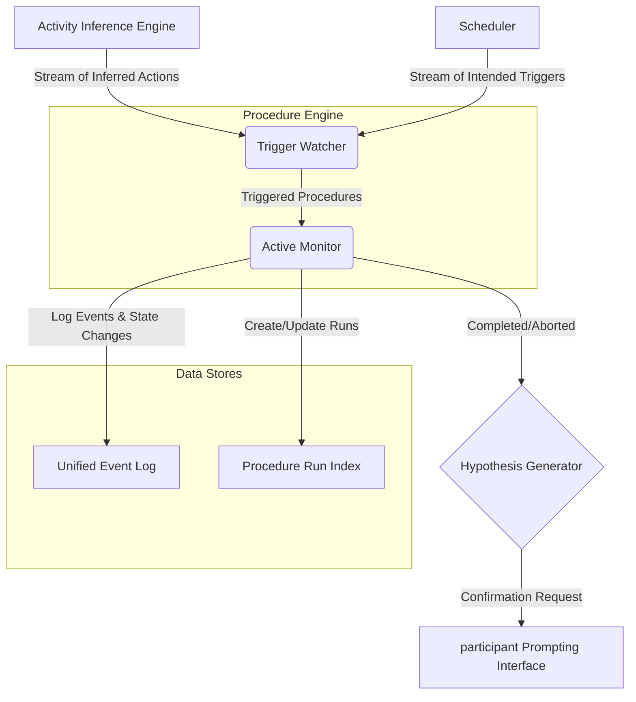

---
title = "The Noet Procedure Engine"
authors = "Andrew Lyjak, Gemini 2.5 Pro, Claude Code"
last_updated = "2025-10-26"
status = "Active"
version = "0.1"
dependencies = [ "procedures.md (v0.1)", "intention_lattice.md (v0.1)", "action_interface.md (v0.1)" ]
---
# The Noet Procedure Engine

## Purpose

This document specifies the architecture and operational logic of the Procedure Engine, the core runtime component that connects participant activity data with defined procedures in the Intention Lattice. It defines:

- The procedure lifecycle state machine (Inactive → Triggered → Active → Completed/Aborted)
- The dual-trigger mechanism (inference-driven and intention-driven)
- Data architecture: Unified Event Log and Procedure Run Index
- The Trigger Watcher and Active Monitor components
- Practice maturity metrics (event density, pattern statistics)
- Handling concurrency and nested procedures

The engine's primary responsibility is to efficiently monitor procedures, track progress, and generate confirmation prompts when patterns complete.

## 2. Core Concepts

The engine manages a state machine for every procedure defined in the participant's lattice. The key challenge is to efficiently monitor a large library of potential procedures without excessive computational overhead.

### Procedure Lifecycle

Every procedure in the lattice exists in one of the following states:

1.  **`Inactive`**: The default state. The procedure's trigger conditions are not met. The engine is not actively monitoring its steps.
2.  **`Triggered`**: The procedure's `context` conditions have been met. The engine has moved the procedure to an active monitoring pool and is now watching for the first step in its `steps` block.
3.  **`Active`**: The first step of the procedure has been detected. The engine is now actively tracking the participant's progress through the defined `steps`.
4.  **`Completed`**: The engine has successfully matched the participant's activity stream to the full `steps` pattern. It generates a hypothesis and passes it to the participant Prompting Interface for confirmation. The procedure then returns to `Inactive`.
5.  **`Aborted`**: The participant was `Active` in the procedure but deviated from the pattern (e.g., a step was missed, a `quality_condition` was violated, or a timeout was exceeded). The procedure returns to `Inactive`.

### The Triggering Mechanism

The `context` block within a procedure's schema is the key to the triggering mechanism. The engine activates procedures based on two distinct types of triggers, creating a dynamic interplay between the participant's inferred actions and their stated intentions.

1.  **Inference-Driven Triggers (Bottom-Up):** These are activated by the participant's current, inferred activity. A procedure with a `context: { during_action: 'act_driving' }` is triggered when the Activity Inference Engine reports that the participant has started driving. This is a reactive, reality-based trigger.

2.  **Intention-Driven Triggers (Top-Down):** These are activated by pre-defined schedules or states within a procedure itself. A procedure with `context: { time_of_day: [08:00, 09:00] }` is triggered at 8:00 AM, regardless of what the participant is currently doing. This is a proactive, intention-based trigger.

When the participant's state matches the `context` of an `Inactive` procedure, the engine moves it to the `Triggered` state.

## 3. Engine Architecture

The engine can be conceptualized as a system that compares two primary inputs: the stream of real-time inferred actions and the stream of scheduled, intended actions.



1.  **Activity Inference Engine:** The bottom-up source of truth for inferred actions.

2.  **Scheduler:** The top-down source of truth for intended actions.

3.  **Trigger Watcher:** Listens to both sources and activates procedures.

4.  **Active Monitor:** Tracks active procedures and, crucially, **writes all state changes and matched steps** to the data stores.

5.  **Unified Event Log & Procedure Run Index:** These are the durable outputs of the engine, replacing the transient "State Tracker."

6.  **Hypothesis Generator:** When a procedure is `Completed`, this component formats the result for participant confirmation.

## 4. Engine Data Architecture

The engine's primary function is to process transient, real-time data and create durable, meaningful records. It does this by maintaining two distinct but related data stores.

### 4.1 The Unified Event Log

This is the **single source of truth**. It is an immutable, append-only log of every event the engine processes or generates. This provides a complete, low-level audit trail for debugging, analysis, and rebuilding other data representations.

**Event Schema:**
```json
{
  "event_id": "uuid",
  "timestamp": "ISO 8601 datetime",
  "source": "'inference', 'scheduler', 'engine', 'participant'",
  "event_type": "'action_detected', 'proc_triggered', 'step_matched', 'proc_completed', 'prompt_sent', 'participant_response'",
  "payload": { ... }
}
```

**Example Events:**
- `(..., 'inference', 'action_detected', { action_id: 'morning_ritual.act_make_coffee', confidence: 0.92 })`
- `(..., 'scheduler', 'proc_triggered', { procedure_id: 'proc_morning_meditation' })`
- `(..., 'engine', 'step_matched', { procedure_id: 'proc_morning_meditation', step_index: 0 })`
- `(..., 'engine', 'prompt_sent', { procedure_id: 'proc_morning_meditation', prompt_text: '...' })`
- `(..., 'participant', 'participant_response', { run_id: '...', variable_name: 'focus_level', value: 8 })`

### 4.2 The Procedure Run Index

This is a **derived, indexed representation** built from the Unified Event Log. Its purpose is to provide fast, queryable access to the "as-run" history of each procedure. It links every specific instance of a procedure's execution back to its definition.

**Run Schema:**
```json
{
  "run_id": "uuid",
  "procedure_id": "uuid of the procedure definition",
  "start_time": "ISO 8601 datetime",
  "end_time": "ISO 8601 datetime",
  "status": "'completed', 'aborted'",
  "event_ids": ["uuid", "uuid", ...], // Foreign keys to the Unified Event Log
  "participant_confirmation": "'yes', 'no', 'sort_of', null"
}
```

This structure allows for powerful historical analysis. A participant can easily query for:
- "Show me all the times I successfully completed my 'Morning Meditation' procedure."
- "How has the duration of my 'Weekly Review' procedure changed over the last three months?"
- "Which steps do I most often get stuck on in my 'Prepare for Bed' routine?"

The **Active Monitor** is responsible for creating a new `run` record when a procedure becomes `Active` and updating it as the procedure progresses, appending `event_ids` and finally setting the `status` and `end_time`.

## 5. The Generative Tension: Inference vs. Intention

The power of this dual-trigger architecture lies in its ability to notice the difference between what is happening and what was intended to happen. This creates opportunities for mindful intervention.

**Scenario:**
- The **Scheduler** emits a trigger for the "Morning Meditation" procedure at 8:00 AM because its `context` is `time_of_day: [08:00, 08:05]`. The procedure becomes `Triggered`.
- The **Activity Inference Engine**, however, is currently reporting that the participant is performing `act_making_coffee`.
- The **Active Monitor** sees that the "Morning Meditation" procedure is `Triggered`, but its first step (`act_meditate`) is not occurring.

In this moment of tension, the engine can do something more sophisticated than simply waiting. It can generate a specific kind of prompt:

> "It's 8:00 AM, the time you set for your 'Morning Meditation.' I see you're currently in the kitchen. Would you like to begin your meditation now, or skip it for today?"

This is the core of the Action-Attention-Intention loop. The system makes the discrepancy visible, creating a choice point where the participant can consciously reaffirm their intention or acknowledge a change in priorities. This is not a failure state; it is the primary mechanism of contemplative practice.

## 6. Handling Complexity and Concurrency

The engine must be able to handle multiple, overlapping, and even nested procedures.

*   **Concurrency:** The Active Monitor can track multiple procedures simultaneously. If the participant's action `act_make_coffee` is the first step in both the "Mindful Morning Coffee" procedure and the "Get Ready for Work" procedure, both will move from `Triggered` to `Active` at the same time. The engine will continue to track both paths.

    **NOTE** (future work) We can't assume the `action_inference_engine.md` will send a completely clean action transmission stream. It's possible for multiple conflicting procedures to appear as if they are triggered simultaneously or semi-simultaneously. We will need to integrate checks to ensure we can proceed or ask for confirmation for calibration reasons when we're not sure what procedure(s) are really active.

*   **Nesting:** If a step in a procedure is another procedure (i.e., a composite action), the engine will recursively trigger the sub-procedure. The parent procedure's progress will be paused until the sub-procedure is `Completed` or `Aborted`.

*   **Efficiency:** The key to efficiency is the **Trigger Watcher**. The system does not need to evaluate the complex `steps` logic for all 100+ procedures in a participant's lattice at all times. It only needs to do simple `context` comparisons. The heavy lifting of pattern matching is only done for the small subset of procedures that are currently `Triggered` or `Active`.

## 7. Practice Maturity Metrics

A powerful emergent property of the Procedure Engine's architecture is the ability to measure **how actualized** each pattern in the lattice is. The separation between durable nodes (Infimum+2) and ephemeral events (Infimum+1) creates a natural metric for tracking the journey from aspiration to habit.

### 7.1 The Event Density Metric

Every observable node (Infimum+2) can be characterized by the quantity and quality of events (Infimum+1) that reference it. This creates a spectrum from purely imaginal (zero events) to deeply habitual (many high-confidence events).

**Pattern Maturity States:**

1. **Imaginal** (event_count = 0)
   - Pattern exists in the lattice but has never been observed
   - Pure aspiration or newly created procedure
   - Example: `act_morning_meditation` created yesterday, zero `action_detected` events

2. **Emerging** (0 < event_count < maturity_threshold)
   - Pattern being actively explored but not yet consistent
   - Characterized by irregular timing, variable confidence scores
   - Example: 5 events over 3 weeks, confidence scores 0.65-0.85
   - This is "learning-by-doing" in its early phase

3. **Established** (event_count ≥ maturity_threshold, high consistency)
   - Pattern has become a reliable habit
   - High confidence scores, consistent timing
   - Example: 80+ events over 3 months, confidence consistently >0.85
   - The procedure has been "deeply learned" through repeated execution

4. **Fading** (event_count plateaued, no recent events)
   - Pattern was once established but is now dormant
   - Example: 50 events, then zero for 30+ days
   - Reveals temporal discontinuity between past-you and present-you

### 7.2 Computed Practice Statistics

The **Active Monitor** computes and updates practice statistics whenever it processes events. These statistics are stored alongside each node in a derived index.

**Practice Profile Schema:**
```json
{
  "node_id": "uuid",
  "practice_statistics": {
    "total_runs": 47,
    "completed_runs": 41,
    "aborted_runs": 6,
    "first_execution": "2024-08-15T07:30:00Z",
    "last_execution": "2024-10-26T07:45:00Z",
    "execution_frequency_days": 2.1,  // Average days between executions
    "consistency_score": 0.78,  // Measure of regularity (0-1)
    "confidence_trend": {
      "mean": 0.82,
      "recent_mean": 0.89,  // Last 10 executions
      "direction": "increasing"  // increasing | stable | decreasing
    },
    "rhythm_analysis": {
      "daily": {
        "strength": 0.92,  // How strongly this pattern follows daily rhythm (0-1)
        "time_of_day_distribution": {
          "07:00": 0.85,  // 85% of events occur around 7am
          "19:30": 0.10   // 10% occur around 7:30pm
        },
        "typical_duration_minutes": 15
      },
      "weekly": {
        "strength": 0.65,
        "day_of_week_distribution": {
          "monday": 0.20,
          "tuesday": 0.20,
          "wednesday": 0.15,
          "thursday": 0.20,
          "friday": 0.15,
          "saturday": 0.05,
          "sunday": 0.05
        }
      },
      "monthly": {
        "strength": 0.35,
        "day_of_month_distribution": {
          "1": 0.15,   // First of month
          "15": 0.20,  // Mid-month
          "last": 0.10 // End of month
        }
      },
      "yearly": {
        "strength": 0.05,
        "seasonal_distribution": {
          "spring": 0.25,
          "summer": 0.25,
          "fall": 0.25,
          "winter": 0.25
        }
      },
      "dominant_rhythm": "daily",  // The strongest rhythm
      "polyrhythmic": true  // Multiple significant rhythms detected
    },
    "redline_frequency": 0.12,  // Ratio of action_correction events
    "maturity_classification": "established",  // imaginal | emerging | established | fading
    "last_updated": "2024-10-26T07:50:00Z",
    
    // NEW (2025-11-19): Motivation Metadata
    // Advisory Council Decision: Separate semantic kinds from motivational metadata
    "motivation_statistics": {
      // Predicted values (set during first reflection, PRIVATE)
      "intrinsic_reward_predicted": 0.8,
      "autonomous_predicted": 0.9,
      "efficacy_predicted": 0.7,
      "relatedness_predicted": null,  // Not tracked for this practice
      
      // Observed values (inferred from behavior + explicit reports, PRIVATE)
      "intrinsic_reward_observed": 0.75,
      "intrinsic_reward_trend": "stable",  // rising | stable | declining
      "autonomous_observed": 0.85,
      "should_pressure_inferred": 0.15,
      "efficacy_observed": 0.80,
      "relatedness_observed": null,
      
      // Prediction error (predicted vs. observed, PRIVATE)
      "prediction_errors": {
        "intrinsic_reward": 0.05,  // |predicted - observed|
        "autonomous": 0.05,
        "efficacy": -0.10  // Negative = exceeded expectations
      },
      
      // Meta
      "last_explicit_report": "2024-10-20T08:00:00Z",
      "inference_confidence": 0.82  // How confident system is in observed values
    }
  }
}
```

**Motivation Statistics Design Notes:**

1. **Privacy Architecture:** These values are PRIVATE and stored locally/encrypted. They are NEVER shared to guilds without explicit consent and anonymization.

2. **Population Mechanisms:**
   - **Predicted values:** Set after initial practice completions via attention window prompts ("What intrinsic reward do you EXPECT?")
   - **Observed values:** Combination of explicit reports (attention windows) and behavioral inference (completion rates, engagement patterns)
   - **Prediction errors:** Learning signal comparing expectations vs. reality ("sparring with reality")

3. **Which Dimensions to Track:** Determined by `motivation_kinds` in the lattice parent_connections (shareable configuration). Only dimensions marked as `true` in `motivation_kinds` are tracked here.

4. **Storage Location:** These statistics live in procedure_engine.md, NOT in intention_lattice.md. The lattice stores only WHICH dimensions to track, not the values.

5. **Self-Determination Theory (SDT) Dimensions:**
   - `intrinsic_reward`: Enjoyment/interest in the activity itself
   - `autonomous`: Sense of choice/volition vs. external pressure
   - `should_pressure`: Internalized obligation energy (controlled motivation)
   - `efficacy`: Perceived competence/effectiveness
   - `relatedness`: Social connection/belonging

6. **Phase 2+ Extended Dimensions** (see design_decisions_consolidated.md Section 14):
   - `craving_intensity`: Immediate pull vs. sustainable reward
   - `immediate_joy`: Short-term pleasure
   - `sustained_reward`: Long-term satisfaction
   - `simplicity`: Cognitive/behavioral ease

### 7.3 Archetype Enactment Statistics

In addition to tracking the maturity of lattice nodes (procedures), the engine also computes statistics for each **archetype**, tracking how and where these patterns of being are enacted. This provides a view into the participant's identity practices, separate from their goal-oriented actions.

These statistics are stored in a separate derived index, keyed by `archetype_id`.

**Archetype Statistics Schema:**
```json
{
  "archetype_id": "uuid",
  "archetype_statistics": {
    "total_enactments": 120,
    "enactment_breakdown": {
      "intended": 80,
      "reactive": 40
    },
    "first_enactment": "2024-08-16T07:30:00Z",
    "last_enactment": "2024-10-28T19:00:00Z",
    "enactment_contexts": [
        { "node_id": "goal_bedtime_story", "count": 45 },
        { "node_id": "goal_homework_help", "count": 30 },
        { "node_id": "goal_park_outing", "count": 45 }
    ],
    "common_relational_pairs": [
        { "pair_with": "arch_curious_child", "count": 90 },
        { "pair_with": "arch_supportive_partner", "count": 30 }
    ],
    "maturity_classification": "established",
    "last_updated": "2024-10-28T19:05:00Z"
  }
}
```

**Schema Fields Explained:**

-   **`total_enactments`**: The total number of times this archetype was referenced in an `embodies` field of a completed procedure.
-   **`enactment_breakdown`**: Differentiates between conscious, `intended` practice and unconscious, `reactive` enactment. This is a key metric for contemplative reflection, surfaced during participant check-ins.
-   **`first_enactment` / `last_enactment`**: Tracks the lifespan of this identity practice.
-   **`enactment_contexts`**: A list of the lattice nodes (procedures) where this archetype is most frequently embodied. This reveals the situations that call forth this pattern of being.
-   **`common_relational_pairs`**: Tracks which other archetypes (from the `with` field) this archetype most frequently interacts with, providing insight into relational dynamics.
-   **`maturity_classification`**: Similar to node maturity, this classifies how integrated the archetype is:
    -   `imaginal`: Defined but never enacted.
    -   `emerging`: Actively being explored.
    -   `established`: A consistent part of the participant's identity practice.
    -   `fading`: Was once established but is no longer being enacted.

This data enables visualizations focused on identity and roles, such as an "Archetype Constellation" showing which roles are most active and how they relate to one another.

### 7.4 Rhythm Analysis: Detecting Temporal Patterns

The engine computes **rhythm analysis** to detect which temporal cycles a pattern follows and how deeply embedded those rhythms are.

**Rhythm Strength (0.0-1.0):**
- Measures consistency of pattern adherence to each cycle
- 1.0 = perfect adherence (e.g., every day at 7am)
- 0.0 = no discernible pattern
- Computed using temporal clustering analysis

**Distribution Tracking:**
For each rhythm, track the distribution of events:
- **Daily**: Time-of-day distribution (most common time windows)
- **Weekly**: Day-of-week distribution
- **Monthly**: Day-of-month distribution (including "last day" handling)
- **Yearly**: Seasonal/quarterly distribution

**Polyrhythmic Detection:**
Many practices follow *multiple* rhythms simultaneously:
- Example: Daily morning meditation (strong daily) + weekdays only (moderate weekly)
- Polyrhythmic = 2+ rhythms with strength > 0.5

**Dominant Rhythm:**
The rhythm with highest strength characterizes the pattern:
- `daily` → daily habit
- `weekly` → weekly practice
- `monthly` → monthly ritual
- `yearly` → seasonal/annual event

### 7.4 Active Monitor Responsibilities

The **Active Monitor** updates practice statistics whenever a procedure run completes or aborts:

**Update Operations:**
1. Increment run counts (total, completed, aborted)
2. Update temporal metrics (first/last execution)
3. Recompute frequency and consistency scores
4. Update rhythm analysis (if ≥5 events)
5. Analyze confidence trends (last 10 events)
6. Compute redline frequency
7. Classify maturity state
8. Persist to Practice Statistics Index

**Maturity Classification Logic:**
- `imaginal`: event_count = 0
- `fading`: days_since_last > 30
- `emerging`: total_runs < 10 OR low consistency/confidence
- `established`: high consistency (>0.7) AND high confidence (>0.8)

### 7.5 Redlines as Adaptive Signals

"Redlines"—deviations from the expected pattern—are captured as `action_correction` events. These are not failures but valuable signals of human adaptability:

```json
{
  "event_type": "action_correction",
  "source": "participant",
  "payload": {
    "original_event_id": "uuid_of_inferred_event",
    "node_id": "act_deep_work",
    "correction_type": "wrong_action",
    "participant_note": "Was in a meeting, not doing deep work"
  }
}
```

High `redline_frequency` indicates:
- The pattern may need refinement (too broad or too narrow)
- The inference model needs retraining
- The context hints are inaccurate
- The participant is adapting the procedure to novel situations

### 7.6 Querying Practice Maturity

The engine exposes query interfaces for accessing practice statistics by:

**Maturity State:**
- Imaginal patterns (unlived aspirations)
- Emerging practices (active learning)
- Established habits
- Fading practices (need attention)

**Rhythm Characteristics:**
- Strong daily habits (daily.strength ≥ 0.8)
- Polyrhythmic practices (multiple significant cycles)
- Rhythm degradation (weakening strength over time)

**Execution Quality:**
- High-redline patterns (need refinement)
- Confidence trends (improving vs. declining)
- Consistency scores

### 7.7 Visualization Implications

These statistics enable participant-facing visualizations:

**Node Visual States:**
- Glow intensity reflects maturity (dim/pulsing/bright/fading)
- Timeline view shows event stream and maturity transitions
- Redline markers show adaptation moments

**Rhythm Visualizations:**
- Circular daily plot (clock face with time-of-day clusters)
- Weekly heatmap (7-day execution density)
- Monthly calendar (execution days marked)
- Yearly rhythm chart (seasonal variations)
- Multi-rhythm display (strength bars for all four cycles)

### 7.8 Temporal Self-Integration

Practice statistics quantify the dialogue between past, present, and future selves:

- **Past-You's Legacy**: See the foundation you built (event history over time)
- **Present-You's Patterns**: Current maturity, redline frequency, confidence trends
- **Future-You's Trajectory**: Frequency projections, maturity transitions (not prediction, but visibility of momentum)

### 7.9 Design Requirements

1. **Incremental Computation**: Statistics update with each event, not recomputed from scratch
2. **Derived Index**: Practice statistics stored separately from event log for efficient querying
3. **Privacy Preservation**: Statistics can aggregate across community without exposing individual events
4. **Minimum Event Threshold**: Rhythm analysis requires ≥5 events for meaningful results

## 8. Implications for the Roadmap

The development of the Procedure Engine is a core part of the application's backend.

1.  **State Management:** A robust mechanism for persisting the state of active procedures is required. This could be a simple in-memory store for a mobile client or a more complex database for a cloud-based version.
2.  **Pattern Matching Logic:** The core of the Active Monitor is a sophisticated pattern matching algorithm that can interpret the v2.1 `steps` schema (including all logical operators).
3.  **Integration with Inference:** The engine requires a clean, stable API to receive the stream of atomic actions from the activity inference pipeline.
4.  **Practice Statistics Index:** A derived data structure for efficiently querying and updating practice maturity metrics as events flow through the engine.

By defining this engine, we have a clear architectural path for how the declarative `procedure` definitions in the lattice are brought to life and used to interpret the participant's ongoing stream of activity. The practice maturity metrics provide quantitative teeth to the contemplative question: "Is this the dance I want to be dancing?"
